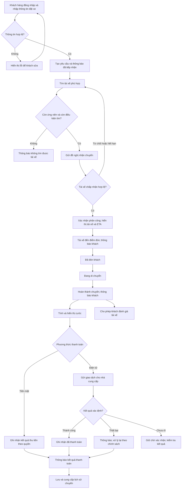
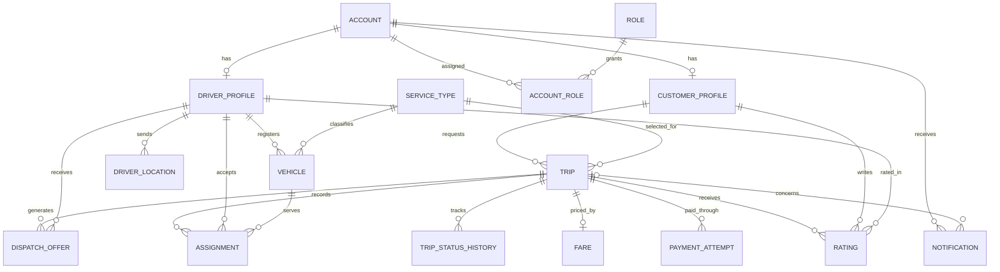

# ĐẶC TẢ YÊU CẦU PHẦN MỀM - HỆ THỐNG CAB

**Doanh nghiệp:** Công ty ABC  
**Sản phẩm:** CAB System – Nền tảng đặt xe  
**Nguồn yêu cầu:** `Customer-Requirement.docx`  
**Thời gian xây dựng và triển khai:** 7 tuần theo yêu cầu khách hàng  
**Trạng thái tài liệu:** Bản phân tích đề xuất, cần các bên liên quan xác nhận trước khi chốt phạm vi phát triển.

Tài liệu mô tả yêu cầu nghiệp vụ và phần mềm theo thông tin khách hàng cung cấp. Các mã CR bên dưới là mã truy vết do người phân tích đặt cho các nhóm nội dung trong file Word, không phải mã có sẵn trong tài liệu nguồn. Các nội dung ghi **Đề xuất** là cách cụ thể hóa để thảo luận; **TBD** là thông tin chưa được quyết định. Không xem các đề xuất hoặc giá trị TBD là cam kết đã được khách hàng phê duyệt.

| Mã nguồn | Nội dung tương ứng trong file Word |
|---|---|
| CR-01 | Hiện trạng phân công thủ công, khó theo dõi chuyến và thanh toán; thời hạn 7 tuần |
| CR-02 | Tài khoản khách hàng, đặt xe, theo dõi tài xế/ETA/trạng thái, lịch sử, số tiền, đánh giá |
| CR-03 | Tài khoản tài xế, hồ sơ, phương tiện, trạng thái hoạt động, nhận/từ chối chuyến, cập nhật chuyến, vị trí |
| CR-04 | Tìm tài xế theo vị trí, trạng thái và tiêu chí vận hành; tìm tiếp khi từ chối/không phản hồi; thông báo khi không có tài xế |
| CR-05 | Tính cước sau chuyến; tiền mặt và thanh toán điện tử; nhà cung cấp bên ngoài; không lưu thông tin thanh toán nhạy cảm; xử lý thất bại |
| CR-06 | Thông báo cho khách hàng và tài xế; mở rộng các kênh thông báo |
| CR-07 | Quản trị, hỗ trợ sự cố, tra cứu giao dịch, phân quyền và báo cáo vận hành |
| CR-08 | Ổn định khi tải cao, cô lập lỗi thanh toán/thông báo, mở rộng độc lập, triển khai từng phần |
| CR-09 | Xác thực, kiểm soát quyền, bảo vệ dữ liệu và lưu vết thao tác quan trọng |
| CR-10 | Các chính sách chưa chốt và khả năng mở rộng dịch vụ, thanh toán, thông báo, thành phần kỹ thuật |

## 1. STAKEHOLDERS

Stakeholder là bên có lợi ích hoặc ảnh hưởng đến hệ thống; không nhất thiết trực tiếp sử dụng phần mềm.

| Mã | Bên liên quan | Vai trò và mối quan tâm |
|---|---|---|
| ST-01 | Ban giám đốc Công ty ABC | Phê duyệt mục tiêu, phạm vi, chính sách; theo dõi tăng trưởng và hiệu quả kinh doanh |
| ST-02 | Khách hàng đặt xe | Đặt xe thuận tiện, biết trạng thái chuyến, thanh toán và đánh giá tài xế |
| ST-03 | Tài xế | Nhận chuyến phù hợp, quản lý trạng thái hoạt động và cập nhật quá trình phục vụ |
| ST-04 | Nhân viên vận hành | Quản lý dữ liệu, giám sát chuyến, hỗ trợ sự cố và tra cứu giao dịch |
| ST-05 | Người phụ trách quyền quản trị | Quyết định quyền đối với thao tác nhạy cảm; vai trò cụ thể cần ABC xác nhận |
| ST-06 | Nhà cung cấp thanh toán | Tích hợp giao dịch điện tử, trả kết quả và hỗ trợ xử lý giao dịch |
| ST-07 | BA, nhóm phát triển, kiểm thử và triển khai | Làm rõ, hiện thực và kiểm chứng yêu cầu trong thời hạn 7 tuần |
| ST-08 | Nhà cung cấp bản đồ/định vị và thông báo, nếu sử dụng | Đối tác kỹ thuật dự kiến; nhà cung cấp và phạm vi dịch vụ là TBD |

ST-05, ST-07 và ST-08 là các vai trò được nhận diện để tổ chức thực hiện; file Word không quy định chi tiết cơ cấu nhân sự hoặc nhà cung cấp cụ thể.

## 2. STAKEHOLDER MATRIX

Ma trận ảnh hưởng–quan tâm dưới đây là đề xuất của BA, cần xác nhận với ABC.

| Stakeholder | Mức ảnh hưởng | Mức quan tâm | Cách phối hợp |
|---|---|---|---|
| ST-01 | Cao | Cao | Chốt phạm vi, giải quyết chính sách TBD, nghiệm thu kết quả |
| ST-02 | Trung bình | Cao | Phỏng vấn và kiểm thử quy trình đặt xe, theo dõi, thanh toán |
| ST-03 | Trung bình | Cao | Xác nhận quy trình nhận chuyến, cập nhật trạng thái và mất kết nối |
| ST-04 | Cao | Cao | Làm rõ tiêu chí điều phối, quản trị và xử lý ngoại lệ |
| ST-05 | Cao | Cao | Xác nhận ma trận quyền và danh mục thao tác nhạy cảm |
| ST-06 | Cao về tích hợp | Trung bình | Thống nhất giao tiếp, kết quả giao dịch và môi trường kiểm thử |
| ST-07 | Cao về triển khai | Cao | Rà soát tính khả thi, phụ thuộc và tiêu chí nghiệm thu |
| ST-08 | Trung bình | Trung bình | Xác nhận khả năng cung cấp dịch vụ và xử lý gián đoạn |

## 3. BUSINESS GOALS

| Mã | Mục tiêu | Chỉ số đánh giá đề xuất | Giá trị mục tiêu |
|---|---|---|---|
| BG-01 | Giảm phụ thuộc vào phân công tài xế thủ công | Tỷ lệ yêu cầu được ghép tự động; thời gian từ tạo yêu cầu đến nhận chuyến | TBD |
| BG-02 | Tăng khả năng theo dõi và minh bạch với khách hàng | Tỷ lệ chuyến có thông tin tài xế, ETA và trạng thái được cập nhật | TBD |
| BG-03 | Quản lý tập trung cước và thanh toán | Tỷ lệ chuyến hoàn thành có cước và trạng thái thanh toán truy xuất được | TBD |
| BG-04 | Nâng cao hiệu quả giám sát vận hành | Khả năng tra cứu chuyến/giao dịch và cung cấp đủ các báo cáo yêu cầu | Có đủ nhóm báo cáo tại FR-25; công thức TBD |
| BG-05 | Hỗ trợ tăng trưởng và mở rộng sản phẩm | Kết quả kiểm thử tải, cô lập lỗi và mở rộng thành phần | Ngưỡng tải và chất lượng dịch vụ TBD |
| BG-06 | Bảo vệ dữ liệu và kiểm soát trách nhiệm thao tác | Kết quả kiểm thử xác thực, phân quyền và truy vết | Đáp ứng NFR-05 đến NFR-08 |

Không tự đặt các cam kết như giảm 50% thời gian điều phối hoặc phục vụ 10.000 người dùng đồng thời khi chưa có dữ liệu và sự đồng ý của ABC.

## 4. SYSTEM SCOPE

### 4.1. Trong phạm vi

- Quản lý tài khoản và hồ sơ khách hàng, tài xế; thông tin phương tiện và trạng thái tài xế.
- Đặt xe theo điểm đón, điểm đến, loại xe; tìm và phân công tài xế; tiếp tục tìm khi đề nghị nhận chuyến bị từ chối hoặc hết hạn.
- Theo dõi tài xế, ETA và các trạng thái thực hiện chuyến; lưu vị trí phục vụ điều phối.
- Tính cước khi hoàn thành, thanh toán tiền mặt và điện tử qua một nhà cung cấp bên ngoài.
- Thông báo các sự kiện chuyến đi và thanh toán; lịch sử chuyến và đánh giá sau chuyến.
- Giao diện vận hành quản lý khách hàng, tài xế, phương tiện, chuyến đi; hỗ trợ lỗi; tra cứu giao dịch; phân quyền và báo cáo.
- Các yêu cầu bảo mật, lưu vết, ổn định, cô lập lỗi, mở rộng và triển khai từng phần.

### 4.2. Chưa đưa vào cam kết triển khai

File Word không yêu cầu khuyến mãi, ví CAB, chia sẻ chuyến, đặt xe định kỳ, trả lương tài xế, giao hàng hoặc tích hợp tổng đài. Những chức năng này chỉ được bổ sung khi có yêu cầu và phê duyệt thay đổi phạm vi. Tổng đài được mô tả là hiện trạng, chưa đồng nghĩa với yêu cầu tích hợp.

Việc thêm dịch vụ, phương thức thanh toán và nhà cung cấp thông báo trong tương lai là yêu cầu về khả năng mở rộng; chưa phải cam kết tích hợp nhiều nhà cung cấp ngay trong bản đầu tiên.

### 4.3. Ranh giới và ràng buộc

- CAB quản lý yêu cầu đặt xe, phân công, trạng thái chuyến, cước, tham chiếu giao dịch và kết quả thanh toán. Nhà cung cấp thanh toán xử lý dữ liệu thanh toán nhạy cảm.
- Thiết bị cung cấp dữ liệu vị trí; giải pháp bản đồ và tính ETA cần xác nhận.
- Không ấn định kiến trúc microservices, công nghệ, nền tảng web/mobile hoặc nhà cung cấp cụ thể từ tài liệu nghiệp vụ này.
- Thời hạn 7 tuần là ràng buộc của khách hàng. Tính khả thi của toàn bộ phạm vi phải được đánh giá theo nguồn lực và phụ thuộc tích hợp; không mặc nhiên xem toàn bộ yêu cầu đã có thể hoàn thành trong thời hạn đó.

## 5. ACTORS

Actor là vai trò bên ngoài tương tác với CAB. Các thành phần nội bộ như bộ tìm tài xế hoặc bộ tính cước không phải actor.

| Mã | Actor | Tương tác |
|---|---|---|
| AC-01 | Khách hàng | Đăng ký/đăng nhập, cập nhật hồ sơ, đặt và theo dõi xe, thanh toán, xem lịch sử, đánh giá |
| AC-02 | Tài xế | Đăng ký/đăng nhập, cập nhật hồ sơ/phương tiện/vị trí, đổi trạng thái, nhận hoặc từ chối và thực hiện chuyến |
| AC-03 | Nhân viên vận hành | Quản lý dữ liệu được cấp quyền, giám sát, hỗ trợ chuyến lỗi, tra cứu giao dịch và báo cáo |
| AC-04 | Người quản trị quyền – đề xuất | Quản lý quyền thao tác nhạy cảm; có thể là vai trò đặc quyền của AC-03 |
| AC-05 | Nhà cung cấp thanh toán | Tiếp nhận yêu cầu thanh toán điện tử và cung cấp kết quả |
| AC-06 | Dịch vụ bản đồ/ETA – dự kiến | Cung cấp thông tin địa lý hoặc ETA nếu được lựa chọn |
| AC-07 | Nhà cung cấp thông báo – dự kiến | Chuyển thông báo qua kênh ngoài nếu được lựa chọn |

Ban giám đốc là stakeholder; chỉ trở thành actor riêng nếu ABC yêu cầu tài khoản xem báo cáo trực tiếp. Hiện quyền truy cập báo cáo cần xác nhận tại TBD-11.

## 6. MVP MODULES

Các module dưới đây đề xuất phạm vi bản đầu tiên theo quy trình trọn vẹn trong Word. Đây là phân rã chức năng, không mặc định mỗi module phải là một dịch vụ triển khai riêng.

| Mã | Module | Nội dung tối thiểu đề xuất | Phụ thuộc |
|---|---|---|---|
| MVP-01 | Tài khoản và truy cập | Tài khoản, hồ sơ, xác thực và phân quyền | Chính sách tài khoản/quyền |
| MVP-02 | Tài xế và phương tiện | Hồ sơ xe, trạng thái sẵn sàng, vị trí | MVP-01, nguồn vị trí |
| MVP-03 | Đặt xe và điều phối | Tạo yêu cầu, tìm tài xế, nhận/từ chối, tìm tiếp, báo không có xe | MVP-01/02, tiêu chí điều phối |
| MVP-04 | Thực hiện và theo dõi chuyến | Thông tin tài xế, ETA, trạng thái chuyến | MVP-03, dữ liệu vị trí/ETA |
| MVP-05 | Cước và thanh toán | Tính cước, tiền mặt, một tích hợp điện tử, kết quả và xử lý thất bại | MVP-04, chính sách cước, đối tác thanh toán |
| MVP-06 | Thông báo | Các sự kiện được yêu cầu; kênh triển khai đầu tiên TBD | MVP-03/04/05 |
| MVP-07 | Lịch sử và đánh giá | Lịch sử chuyến, số tiền, đánh giá sau hoàn thành | MVP-04/05 |
| MVP-08 | Vận hành và báo cáo | Quản lý, giám sát, hỗ trợ sự cố, giao dịch, các báo cáo cơ bản | Dữ liệu các module, phân quyền |

Bảo mật, lưu vết, cô lập lỗi và khả năng mở rộng áp dụng xuyên suốt. Nếu nguồn lực không đáp ứng thời hạn 7 tuần, BA cần trình phương án giảm hoặc chia giai đoạn phạm vi cho ABC phê duyệt; không tự loại bỏ yêu cầu có trong Word.

## 7. BUSINESS REQUIREMENTS

| Mã | Yêu cầu nghiệp vụ | Mục tiêu | Nguồn |
|---|---|---|---|
| BR-01 | Doanh nghiệp phải cung cấp kênh quản lý tài khoản và đặt xe trực tuyến cho khách hàng | BG-02 | CR-02 |
| BR-02 | Doanh nghiệp phải quản lý tài xế, phương tiện và tình trạng sẵn sàng phục vụ | BG-01 | CR-03 |
| BR-03 | Yêu cầu đặt xe phải được tìm tài xế phù hợp tự động và có cơ chế tìm thay thế | BG-01 | CR-04 |
| BR-04 | Khách hàng và vận hành phải theo dõi được diễn biến chuyến đi | BG-02, BG-04 | CR-02/03/07 |
| BR-05 | Doanh nghiệp phải xác định cước và quản lý kết quả thanh toán tiền mặt/điện tử tập trung | BG-03 | CR-05 |
| BR-06 | Khách hàng và tài xế phải được thông báo các sự kiện liên quan | BG-02 | CR-06 |
| BR-07 | Khách hàng phải xem được lịch sử, số tiền và đánh giá tài xế sau chuyến | BG-02 | CR-02 |
| BR-08 | Vận hành phải quản lý dữ liệu, hỗ trợ sự cố và truy xuất báo cáo kinh doanh | BG-04 | CR-07 |
| BR-09 | Hệ thống phải bảo vệ dữ liệu, kiểm soát quyền và lưu vết thao tác quan trọng | BG-06 | CR-09 |
| BR-10 | Nền tảng phải duy trì đặt xe khi thanh toán/thông báo gặp lỗi và hỗ trợ mở rộng, triển khai từng phần | BG-05 | CR-08/10 |

## 8. BUSINESS PROCESS MODELING

### 8.1. Quy trình nghiệp vụ chính

Sơ đồ dưới đây là lưu đồ nghiệp vụ bằng Mermaid, không phải sơ đồ BPMN 2.0.

Điều kiện dừng tìm kiếm, thời gian hết hạn và cách xử lý lại thanh toán là TBD. Không tự động tạo giao dịch mới khi chưa rõ kết quả giao dịch trước. Đánh giá phụ thuộc chuyến hoàn thành; Word không yêu cầu phải thanh toán thành công mới được đánh giá.

### 8.2. Mô hình trạng thái đề xuất

| Đối tượng | Các trạng thái và chuyển đổi chính |
|---|---|
| Chuyến đi | Đang tìm tài xế → Đã phân công → Đã đến điểm đón → Đã đón khách → Đang di chuyển → Hoàn thành |
| Nhánh tìm kiếm | Đang tìm tài xế → Không tìm được tài xế khi đạt điều kiện dừng |
| Hủy chuyến | Chuyển sang Đã hủy từ những trạng thái được chính sách cho phép; tác nhân, điều kiện và phí là TBD |
| Đề nghị nhận chuyến | Chờ phản hồi → Chấp nhận / Từ chối / Hết hạn; cần vô hiệu hóa đề nghị không còn hiệu lực |
| Thanh toán | Chưa thanh toán → Đang xử lý → Thành công / Thất bại; kết quả chưa xác định tiếp tục ở trạng thái chờ xác nhận |
| Tài xế | Không sẵn sàng ↔ Sẵn sàng; Sẵn sàng → Đang phục vụ khi phân công; trạng thái sau chuyến cần xác nhận |

Trạng thái chuyến và thanh toán được quản lý riêng: chuyến đã hoàn thành không trở thành chưa hoàn thành chỉ vì thanh toán thất bại. Hủy là luồng cần phân tích do Word yêu cầu báo cáo tỷ lệ hủy nhưng chưa cung cấp chính sách hủy.

## 9. FUNCTIONAL REQUIREMENTS

“Hệ thống phải” ở bảng này mô tả yêu cầu chức năng dự kiến để nghiệm thu. Các phần phụ thuộc TBD chỉ được chốt sau khi có chính sách tương ứng.

| Mã | Yêu cầu chức năng | Tiêu chí nghiệm thu chính |
|---|---|---|
| FR-01 | Cho phép khách hàng đăng ký, đăng nhập và cập nhật thông tin cá nhân | Tạo được tài khoản hợp lệ; đăng nhập bằng thông tin hợp lệ; thay đổi hồ sơ được lưu và hiển thị lại; trường dữ liệu/xác minh theo TBD-08 |
| FR-02 | Cho phép tài xế tự đăng ký hoặc được vận hành tạo tài khoản, đăng nhập và cập nhật hồ sơ | Cả hai đường tạo tài khoản đều hoạt động theo quyền; cơ chế duyệt hồ sơ theo TBD-08 |
| FR-03 | Cho phép quản lý thông tin phương tiện gắn với tài xế | Lưu và truy xuất đúng phương tiện; dữ liệu bắt buộc và điều kiện sử dụng theo TBD-08 |
| FR-04 | Cho phép tài xế cập nhật trạng thái hoạt động và gửi vị trí | Trạng thái mới được lưu; vị trí có thời điểm ghi nhận; dữ liệu dùng được cho điều phối theo chính sách độ mới TBD-06 |
| FR-05 | Cho phép khách hàng nhập điểm đón, điểm đến, chọn loại xe và gửi yêu cầu | Yêu cầu hợp lệ tạo mã chuyến và trạng thái đang tìm; thiếu dữ liệu bắt buộc thì thông báo để sửa |
| FR-06 | Tìm và ưu tiên tài xế theo vị trí, trạng thái sẵn sàng và tiêu chí vận hành | Với bộ dữ liệu kiểm thử đã thống nhất, danh sách ứng viên và thứ tự phù hợp với TBD-02 |
| FR-07 | Gửi đề nghị nhận chuyến; cho tài xế chấp nhận hoặc từ chối | Phản hồi gắn đúng tài xế/chuyến/đề nghị; chỉ phản hồi còn hiệu lực được dùng để phân công |
| FR-08 | Tiếp tục tìm khi tài xế từ chối hoặc không phản hồi; thông báo khi không tìm được | Giữ nguyên yêu cầu của khách; thử ứng viên tiếp theo; kết thúc theo TBD-03 và hiển thị kết quả rõ ràng |
| FR-09 | Hiển thị tài xế đã nhận chuyến, ETA và trạng thái hiện tại cho khách hàng | Chỉ hiển thị phân công đã được xác nhận; cập nhật theo dữ liệu hiện có; thể hiện khi ETA không khả dụng |
| FR-10 | Cho tài xế cập nhật đã đến, đã đón khách, đang di chuyển và hoàn thành | Lưu trạng thái và thời điểm; chỉ tài xế được phân công hoặc vai trò hỗ trợ được cấp quyền mới được cập nhật |
| FR-11 | Cung cấp lịch sử chuyến và số tiền phải trả cho khách hàng | Khách xem được các chuyến của mình cùng cước/trạng thái thanh toán; không xem được lịch sử của người khác |
| FR-12 | Cho phép khách hàng đánh giá tài xế sau khi hoàn thành chuyến | Chỉ khách của chuyến hoàn thành được gửi đánh giá; thang điểm và sửa đánh giá theo TBD-10 |
| FR-13 | Xác định số tiền phải trả sau chuyến theo loại dịch vụ và thông tin chuyến đi | Kết quả đúng bộ ví dụ tính cước được ABC duyệt tại TBD-01; lưu kết quả gắn với chuyến |
| FR-14 | Hỗ trợ thanh toán tiền mặt và ghi nhận kết quả thu tiền | Tiền mặt không mặc nhiên là đã thu; người có quyền ghi nhận kết quả theo TBD-05 |
| FR-15 | Tích hợp thanh toán điện tử qua nhà cung cấp bên ngoài | Tạo yêu cầu tương ứng khoản phải trả; lưu tham chiếu và trạng thái; không lưu trực tiếp thông tin thẻ/tài khoản nhạy cảm |
| FR-16 | Nhận và cập nhật kết quả thanh toán điện tử | Kết quả hợp lệ cập nhật đúng giao dịch; thông báo lặp không ghi nhận thu tiền thêm; kết quả chưa rõ giữ chờ xác nhận |
| FR-17 | Thông báo thanh toán thất bại và hỗ trợ xử lý lại theo chính sách | Hiển thị thất bại; cung cấp cách xử lý được TBD-05 cho phép; không coi hết thời gian chờ là chắc chắn thất bại |
| FR-18 | Thông báo cho khách khi tiếp nhận đặt xe, tài xế nhận, tài xế đến, chuyến hoàn thành và thanh toán có kết quả | Mỗi loại sự kiện tạo thông báo đúng khách/chuyến; kênh và thời hạn chuyển theo TBD-09/12 |
| FR-19 | Thông báo cho tài xế về chuyến mới và thay đổi liên quan chuyến đang thực hiện | Tài xế nhận đúng thông báo của mình; lỗi thông báo không làm mất dữ liệu chuyến |
| FR-20 | Cung cấp giao diện vận hành quản lý khách hàng, tài xế và phương tiện | Người có quyền tra cứu/cập nhật được dữ liệu trong phạm vi quyền; danh mục thao tác theo TBD-11 |
| FR-21 | Cho vận hành xem chuyến đang diễn ra và trạng thái tài xế | Tra cứu được chuyến, phân công, trạng thái và thời điểm cập nhật |
| FR-22 | Cho vận hành hỗ trợ các chuyến bị lỗi | Xem được thông tin sự cố; thao tác khắc phục giới hạn theo TBD-11 và được lưu vết |
| FR-23 | Cho vận hành tra cứu lịch sử giao dịch | Tra cứu được tham chiếu, chuyến, số tiền, phương thức và kết quả trong phạm vi được cấp quyền |
| FR-24 | Kiểm soát quyền đối với chức năng quản trị và thao tác nhạy cảm | Kiểm tra quyền ở phía hệ thống xử lý; yêu cầu vượt quyền bị từ chối kể cả khi gọi trực tiếp |
| FR-25 | Cung cấp báo cáo số chuyến, doanh thu, tỷ lệ hoàn thành, tỷ lệ hủy và hiệu quả tài xế | Đủ năm nhóm chỉ số; khớp dữ liệu mẫu và công thức/kỳ báo cáo được duyệt tại TBD-13 |
| FR-26 | Lưu vết thao tác quan trọng | Ghi nhận chủ thể, thao tác, đối tượng, thời điểm và kết quả theo danh mục được duyệt; truy xuất theo quyền |
| FR-27 | Ghi nhận và xử lý hủy chuyến theo chính sách được duyệt | **TBD:** tác nhân có quyền, trạng thái được hủy, lý do, phí và cách giải phóng phân công phải được xác nhận trước khi nghiệm thu |

## 10. BUSINESS RULES

| Mã | Quy tắc | Cơ sở / trạng thái |
|---|---|---|
| RULE-01 | Khách hàng và tài xế phải được xác thực trước khi dùng chức năng yêu cầu tài khoản | CR-09; đăng ký không yêu cầu đã đăng nhập |
| RULE-02 | Việc tìm tài xế phải xét vị trí, trạng thái sẵn sàng và tiêu chí vận hành | CR-04; tiêu chí và trọng số TBD-02 |
| RULE-03 | Khi tài xế từ chối hoặc không phản hồi, hệ thống tìm tài xế khác trên cùng yêu cầu đặt xe | CR-04; thời hạn và điều kiện dừng TBD-03 |
| RULE-04 | Mỗi chuyến chỉ có một phân công đang hiệu lực; phản hồi hết hạn không được ghi đè phân công | Đề xuất ràng buộc nhất quán; cần xác nhận cách phục vụ đồng thời tại TBD-02 |
| RULE-05 | Các cập nhật chuyến phải tuân theo luồng trạng thái và quyền được duyệt | Đề xuất cụ thể hóa CR-03/09; quyền sửa trạng thái TBD-11 |
| RULE-06 | Cước sau chuyến phụ thuộc loại dịch vụ và thông tin chuyến đi | CR-05; công thức, làm tròn và phụ phí TBD-01 |
| RULE-07 | CAB hỗ trợ tiền mặt và thanh toán điện tử; không lưu trực tiếp dữ liệu thẻ/tài khoản thanh toán nhạy cảm | CR-05 |
| RULE-08 | Thanh toán thất bại phải được thông báo và xử lý lại theo chính sách của ABC | CR-05; chính sách TBD-05 |
| RULE-09 | Một kết quả giao dịch không được làm ghi nhận thanh toán thành công nhiều lần | Đề xuất ràng buộc nhất quán cho CR-05 |
| RULE-10 | Khách hàng được đánh giá tài xế sau khi chuyến hoàn thành | CR-02; thang điểm, số lần và quyền sửa TBD-10 |
| RULE-11 | Thao tác quản trị nhạy cảm chỉ được thực hiện với quyền phù hợp | CR-07/09; ma trận quyền TBD-11 |
| RULE-12 | Hủy chuyến tuân theo chính sách về tác nhân, thời điểm, lý do và phí | Chưa chốt trong CR-10; TBD-04 |
| RULE-13 | Dữ liệu được lưu và xử lý hết hạn theo chính sách lưu trữ đã duyệt | Chưa chốt trong CR-10; TBD-07 |

## 11. NON-FUNCTIONAL REQUIREMENTS

Các ngưỡng định lượng chưa có trong Word phải được chốt trước khi dùng làm tiêu chí nghiệm thu. Không mặc định các mức 99,9%, 2 giây hoặc một số lượng người dùng cụ thể.

| Mã | Thuộc tính | Yêu cầu và cách kiểm chứng |
|---|---|---|
| NFR-01 | Hiệu năng | Đặt xe, ghép tài xế và cập nhật trạng thái đáp ứng ngưỡng thời gian dưới tải đỉnh được thống nhất. Kiểm thử tải với số người dùng, tài xế, yêu cầu/giây và ngưỡng p95 tại TBD-12 |
| NFR-02 | Cô lập lỗi | Gián đoạn thanh toán hoặc thông báo không làm toàn bộ chức năng đặt xe dừng. Kiểm thử ngắt từng tích hợp và xác nhận vẫn tạo/điều phối được chuyến, giữ trạng thái lỗi hoặc chờ xử lý đúng |
| NFR-03 | Mở rộng độc lập | Các thành phần cần có khả năng tăng năng lực riêng khi tải tăng. Kiểm chứng bằng kịch bản tăng tải ở một thành phần và đánh giá tác động; cách tổ chức triển khai do thiết kế kỹ thuật quyết định |
| NFR-04 | Khả năng thay đổi | Có thể triển khai chức năng từng phần và bổ sung dịch vụ, thanh toán hoặc nhà cung cấp thông báo mà hạn chế ảnh hưởng chức năng hiện có. Rà soát hợp đồng tích hợp và kiểm thử hồi quy khi thay một thành phần |
| NFR-05 | Xác thực và phân quyền | Bảo vệ chức năng yêu cầu tài khoản và quản trị bằng xác thực/kiểm tra quyền; kiểm thử truy cập chưa đăng nhập, sai vai trò và tài nguyên của người khác |
| NFR-06 | Bảo vệ dữ liệu | Bảo vệ thông tin cá nhân, phương tiện, vị trí và giao dịch. Biện pháp đề xuất: mã hóa đường truyền, bảo vệ dữ liệu lưu, hạn chế quyền và loại bỏ dữ liệu nhạy cảm khỏi log; tiêu chuẩn cụ thể cần được duyệt |
| NFR-07 | Dữ liệu thanh toán | Không lưu trực tiếp thông tin nhạy cảm của thẻ/tài khoản thanh toán trong cơ sở dữ liệu, log hoặc bản sao lưu CAB. Kiểm tra luồng tích hợp và các nơi lưu dữ liệu |
| NFR-08 | Khả năng kiểm tra | Lưu vết thao tác quan trọng và bảo vệ quyền truy cập log. Danh mục sự kiện, thời gian lưu và quyền xem theo TBD-07/11; kiểm thử truy xuất dấu vết của thao tác mẫu |
| NFR-09 | Nhất quán – đề xuất | Xử lý phản hồi nhận chuyến và kết quả thanh toán lặp/đồng thời mà không tạo phân công hoặc ghi nhận thu tiền trùng; kiểm thử sự kiện lặp, đến muộn và đồng thời |
| NFR-10 | Sẵn sàng và phục hồi | Hệ thống hoạt động ổn định trong thời gian dịch vụ đã thống nhất. Mức sẵn sàng, thời gian khôi phục và mức mất dữ liệu chấp nhận được là TBD-12; kiểm chứng bằng giám sát và diễn tập phục hồi |
| NFR-11 | Độ mới của dữ liệu vị trí – đề xuất | Phân biệt vị trí hiện hành với vị trí cũ, không hiển thị dữ liệu cũ như đang trực tiếp. Chu kỳ cập nhật và ngưỡng cũ theo TBD-06 |

## 12. EXCEPTION CASES

| Mã | Tình huống | Hành vi yêu cầu / đề xuất | Liên quan |
|---|---|---|---|
| EX-01 | Thiếu hoặc không hợp lệ điểm đón/điểm đến/loại xe | Báo dữ liệu cần sửa; không tạo yêu cầu thiếu thông tin bắt buộc | FR-05 |
| EX-02 | Không có tài xế phù hợp hoặc đạt điều kiện dừng | Thông báo rõ không tìm được tài xế; ghi kết quả của yêu cầu | FR-06/08, TBD-03 |
| EX-03 | Tài xế từ chối hoặc hết hạn phản hồi | Vô hiệu hóa đề nghị tương ứng và tiếp tục tìm trên cùng yêu cầu | FR-07/08 |
| EX-04 | Nhận chuyến đồng thời hoặc phản hồi đến muộn | Đề xuất chỉ xác nhận một phân công hợp lệ; báo đề nghị không còn hiệu lực cho phản hồi còn lại | FR-07, RULE-04 |
| EX-05 | Không có vị trí hoặc vị trí đã cũ | Đề xuất thể hiện không có dữ liệu mới; áp dụng chính sách có được tiếp tục ghép/hiển thị ETA theo TBD-06 | FR-04/06/09 |
| EX-06 | Khách hoặc tài xế mất kết nối | Đề xuất đồng bộ lại khi kết nối trở lại và chống tạo chuyến/cập nhật trùng khi gửi lại | FR-04/05/10, TBD-06 |
| EX-07 | Thanh toán bị nhà cung cấp xác nhận thất bại | Ghi thất bại, thông báo khách và cho xử lý lại theo chính sách | FR-17, TBD-05 |
| EX-08 | Gửi thanh toán bị hết thời gian chờ, chưa biết kết quả | Đề xuất giữ chờ xác nhận và kiểm tra giao dịch cũ trước khi tạo lần thanh toán mới | FR-16/17 |
| EX-09 | Kết quả thanh toán gửi lặp hoặc không hợp lệ | Đề xuất kiểm tra nguồn/kết quả; không ghi nhận thu tiền trùng; lưu thông tin phục vụ kiểm tra | FR-16/26 |
| EX-10 | Dịch vụ thông báo gián đoạn | Không dừng đặt xe; lưu tình trạng lỗi; cơ chế gửi lại và giới hạn TBD-09 | FR-18/19, NFR-02 |
| EX-11 | Cập nhật trạng thái trái luồng hoặc sai quyền | Từ chối thay đổi, giữ trạng thái hợp lệ; lưu vết nếu thuộc thao tác quan trọng | FR-10/24/26 |
| EX-12 | Yêu cầu hủy hoặc tài xế không thể tiếp tục phục vụ | Xử lý quyền hủy, phí, hỗ trợ hoặc tìm lại theo chính sách chưa chốt | FR-22/27, TBD-04 |
| EX-13 | Thiếu dữ liệu tính cước hoặc cấu hình cước không hợp lệ | Đề xuất ghi nhận cần xử lý, không tự gán cước bằng 0; chuyển vận hành kiểm tra | FR-13/22, TBD-01 |
| EX-14 | Dịch vụ ETA không khả dụng | Đề xuất báo ETA tạm không khả dụng; vẫn hiển thị trạng thái chuyến đã có; điều kiện tiếp tục điều phối TBD-06 | FR-09 |

## 13. OPEN QUESTIONS / TBD

| Mã | Câu hỏi cần chốt | Bên xác nhận | Ảnh hưởng |
|---|---|---|---|
| TBD-01 | Công thức cước theo loại dịch vụ là gì? Dùng quãng đường/thời gian nào, phụ phí và làm tròn ra sao? Xử lý thiếu dữ liệu hoặc tính lại thế nào? | Ban giám đốc, vận hành | FR-13, RULE-06, EX-13 |
| TBD-02 | Tài xế phù hợp theo bán kính, loại xe và ưu tiên nào? Gửi đề nghị tuần tự hay đồng thời? Một tài xế được phục vụ bao nhiêu chuyến cùng lúc? | Vận hành, tài xế, ban giám đốc | FR-06/07, RULE-02/04 |
| TBD-03 | Thời gian phản hồi, số lần thử, cách mở rộng tìm kiếm và điều kiện kết luận không có tài xế là gì? | Vận hành | FR-08, RULE-03 |
| TBD-04 | Ai được hủy, ở trạng thái nào, có phí không? Xử lý tài xế bỏ chuyến, khách không xuất hiện và tìm lại xe ra sao? | Ban giám đốc, vận hành | FR-27, RULE-12, EX-12 |
| TBD-05 | Chọn nhà cung cấp nào? Ai xác nhận tiền mặt? Thử thanh toán lại, đổi phương thức, kết quả chưa rõ và hoàn tiền nếu phát sinh được xử lý thế nào? | Ban giám đốc, vận hành, đối tác thanh toán | FR-14–17, EX-07–09 |
| TBD-06 | Chu kỳ gửi vị trí, ngưỡng vị trí cũ, nguồn ETA và chính sách mất mạng là gì? Sau chuyến tài xế trở lại trạng thái nào? | Vận hành, tài xế, nhóm kỹ thuật | FR-04/09/10, NFR-11, EX-05/06/14 |
| TBD-07 | Lưu hồ sơ, vị trí, chuyến, giao dịch và log bao lâu? Quyền truy cập, xóa và ẩn danh thế nào? | Ban giám đốc, bên phụ trách dữ liệu | RULE-13, NFR-06/08 |
| TBD-08 | Trường đăng ký/hồ sơ bắt buộc, cách xác minh và duyệt tài xế/phương tiện là gì? Quan hệ tài xế–xe có cho phép nhiều xe hoặc nhiều tài xế dùng chung không? | Vận hành | FR-01–03, mô hình thực thể |
| TBD-09 | Kênh thông báo đầu tiên là gì? Có nhà cung cấp ngoài không? Chính sách gửi lại và xử lý thông báo đến muộn thế nào? | Vận hành, nhóm kỹ thuật | FR-18/19, EX-10 |
| TBD-10 | Đánh giá theo thang nào, có nội dung nhận xét không, được sửa hoặc gửi bao nhiêu lần? | Vận hành, đại diện khách hàng | FR-12 |
| TBD-11 | Ma trận quyền, thao tác nhạy cảm, quyền xem báo cáo và quyền khắc phục chuyến lỗi cụ thể là gì? Những thao tác nào phải lưu vết? | Ban giám đốc, vận hành | FR-20–26, RULE-11 |
| TBD-12 | Tải đỉnh, thời gian đáp ứng, độ trễ cập nhật/thông báo, mức sẵn sàng và chỉ tiêu phục hồi cụ thể là bao nhiêu? | Ban giám đốc, vận hành, nhóm kỹ thuật | NFR-01/02/10, nghiệm thu |
| TBD-13 | Doanh thu dựa trên cước hay tiền đã thu? Mẫu số tỷ lệ hoàn thành/hủy, kỳ báo cáo và chỉ số hiệu quả tài xế được định nghĩa thế nào? | Ban giám đốc, vận hành | FR-25, BG-04 |
| TBD-14 | Nền tảng giao diện, địa bàn, danh mục loại xe/dịch vụ, nguồn lực, phụ thuộc đối tác và phạm vi được cam kết trong 7 tuần là gì? | Ban giám đốc, nhóm triển khai | Phạm vi, MVP và kế hoạch nghiệm thu |

Ưu tiên làm rõ TBD-01 đến TBD-06, TBD-08, TBD-11, TBD-12 và TBD-14 trước khi chốt thiết kế và kế hoạch xây dựng. Các TBD còn lại phải được giải quyết trước khi triển khai phần chức năng liên quan. Mỗi quyết định cần ghi người duyệt, ngày duyệt và yêu cầu bị tác động.

## 14. ENTITY MODEL

Đây là mô hình dữ liệu khái niệm đề xuất, không phải lược đồ cơ sở dữ liệu vật lý. Thuộc tính là tập tối thiểu để phân tích, chưa quyết định kiểu dữ liệu hoặc công nghệ lưu trữ.

| Thực thể | Thuộc tính tiêu biểu | Ý nghĩa |
|---|---|---|
| Account | accountId, loginIdentifier, status | Danh tính tài khoản; không lưu mật khẩu dạng rõ |
| Role / AccountRole | roleId, roleName / accountId, roleId | Vai trò và việc gán vai trò cho tài khoản |
| CustomerProfile | customerId, accountId, personalInfo | Hồ sơ khách hàng |
| DriverProfile | driverId, accountId, profileInfo, availability | Hồ sơ và trạng thái tài xế |
| Vehicle | vehicleId, driverId, serviceTypeId, vehicleInfo | Thông tin phương tiện; quan hệ với tài xế cần xác nhận |
| ServiceType | serviceTypeId, name, status | Loại xe/dịch vụ được phép đặt |
| DriverLocation | locationId, driverId, coordinates, recordedAt | Vị trí có thời điểm ghi nhận; thời gian lưu TBD |
| Trip | tripId, customerId, serviceTypeId, pickup, destination, status, createdAt | Yêu cầu và quá trình chuyến đi |
| DispatchOffer | offerId, tripId, driverId, status, offeredAt, expiresAt | Mỗi lần đề nghị tài xế nhận chuyến |
| Assignment | assignmentId, tripId, driverId, vehicleId, status, assignedAt | Phân công được chấp nhận; hỗ trợ giữ lịch sử nếu chính sách cho phép phân công lại |
| TripStatusHistory | historyId, tripId, status, changedBy, changedAt | Lịch sử trạng thái chuyến |
| Fare | fareId, tripId, amount, calculationReference, calculatedAt | Kết quả tính cước và thông tin tham chiếu cách tính |
| PaymentAttempt | paymentId, tripId, method, amount, status, providerReference, createdAt | Lần xử lý thanh toán/ghi nhận thu tiền; không chứa dữ liệu thanh toán nhạy cảm |
| Rating | ratingId, tripId, customerId, driverId, score | Đánh giá sau chuyến; cấu trúc/số lần theo TBD-10 |
| Notification | notificationId, recipientAccountId, tripId, eventType, channel, status | Thông báo và tình trạng chuyển |
| AuditLog | auditId, actorReference, action, entityReference, timestamp, result | Dấu vết thao tác quan trọng |

Ràng buộc bổ sung: một chuyến chỉ có tối đa một phân công đang hiệu lực theo RULE-04 dù có thể giữ nhiều bản ghi lịch sử; nhiều lần thanh toán không có nghĩa được thu trùng; người đánh giá phải là khách của chuyến hoàn thành. Quan hệ tài xế–phương tiện đang giả định một xe thuộc một tài xế và cần xác nhận tại TBD-08. Số lượng đánh giá tối đa chưa chốt. AuditLog dùng tham chiếu chủ thể/đối tượng vì thao tác có thể do người dùng hoặc hệ thống thực hiện. Báo cáo được tổng hợp từ dữ liệu nghiệp vụ, không mặc nhiên cần thực thể riêng.

## 15. USE CASES

### 15.1. Danh mục use case

| Mã | Use case | Actor chính | FR liên quan |
|---|---|---|---|
| UC-01 | Quản lý tài khoản và hồ sơ khách hàng | Khách hàng | FR-01 |
| UC-02 | Quản lý tài khoản tài xế và phương tiện | Tài xế, vận hành | FR-02/03 |
| UC-03 | Cập nhật trạng thái hoạt động và vị trí | Tài xế | FR-04 |
| UC-04 | Đặt xe và tìm tài xế | Khách hàng; tài xế tham gia | FR-05–08 |
| UC-05 | Phản hồi đề nghị nhận chuyến | Tài xế | FR-07/08 |
| UC-06 | Thực hiện và theo dõi chuyến | Tài xế, khách hàng | FR-09/10 |
| UC-07 | Tính cước và thanh toán chuyến | Khách hàng; người xác nhận tiền mặt TBD; nhà cung cấp thanh toán | FR-13–17 |
| UC-08 | Xem lịch sử chuyến và đánh giá | Khách hàng | FR-11/12 |
| UC-09 | Nhận thông báo nghiệp vụ | Khách hàng, tài xế | FR-18/19 |
| UC-10 | Quản lý dữ liệu và hỗ trợ vận hành | Nhân viên vận hành | FR-20–23 |
| UC-11 | Kiểm soát quyền và tra cứu lưu vết | Người có quyền quản trị tương ứng | FR-24/26 |
| UC-12 | Xem báo cáo hoạt động | Người được cấp quyền xem báo cáo | FR-25 |
| UC-13 | Hủy chuyến – chờ chốt chính sách | Actor theo TBD-04 | FR-27 |

### 15.2. UC-04 – Đặt xe và tìm tài xế

- **Mục tiêu:** Tạo một yêu cầu và tìm được tài xế hoặc nhận kết quả không tìm được.
- **Tiền điều kiện:** Khách hàng đã đăng nhập; danh mục loại xe/dịch vụ đã được cấu hình.
- **Kích hoạt:** Khách hàng gửi yêu cầu đặt xe.
- **Luồng chính:**
  1. Khách hàng nhập điểm đón, điểm đến và chọn loại xe.
  2. Hệ thống kiểm tra dữ liệu, tạo chuyến ở trạng thái đang tìm và thông báo tiếp nhận.
  3. Hệ thống chọn ứng viên theo chính sách điều phối và gửi đề nghị nhận chuyến.
  4. Tài xế phản hồi qua UC-05.
  5. Hệ thống xác nhận phản hồi còn hiệu lực, ghi phân công và trạng thái đã phân công.
  6. Khách hàng được thông báo và xem thông tin tài xế, ETA.
- **Luồng thay thế:** Dữ liệu sai → yêu cầu sửa; từ chối/hết hạn → tìm tiếp trên cùng chuyến; hết điều kiện tìm → thông báo không có tài xế; nhận đồng thời/đến muộn → chỉ giữ phân công hợp lệ.
- **Hậu điều kiện:** Chuyến có phân công hợp lệ hoặc kết quả không tìm được; thông tin quá trình tìm được lưu theo chính sách.
- **Quy tắc:** RULE-01–04; chi tiết tìm kiếm phụ thuộc TBD-02/03.

### 15.3. UC-06 – Thực hiện và theo dõi chuyến

- **Tiền điều kiện:** Có phân công hợp lệ; tài xế được xác thực.
- **Kích hoạt:** Tài xế bắt đầu phục vụ chuyến đã nhận.
- **Luồng chính:**
  1. Khách hàng xem tài xế, ETA và trạng thái hiện có.
  2. Tài xế cập nhật đã đến điểm đón; hệ thống ghi nhận và thông báo khách.
  3. Tài xế cập nhật đã đón khách, sau đó đang di chuyển.
  4. Hệ thống lưu và cung cấp trạng thái mới cho khách hàng/vận hành theo quyền.
  5. Tài xế cập nhật hoàn thành; hệ thống ghi thời điểm, thông báo và chuyển sang tính cước.
- **Ngoại lệ:** Sai quyền/trái luồng → từ chối; mất mạng/vị trí cũ → EX-05/06; hủy hoặc không thể tiếp tục → xử lý theo TBD-04.
- **Hậu điều kiện:** Chuyến hoàn thành có lịch sử trạng thái; kết quả thanh toán được quản lý riêng.

### 15.4. UC-07 – Tính cước và thanh toán chuyến

- **Tiền điều kiện:** Chuyến hoàn thành và có đủ dữ liệu tính cước; công thức và phương thức đã được cấu hình.
- **Kích hoạt:** Ghi nhận hoàn thành chuyến.
- **Luồng chính – điện tử:**
  1. Hệ thống tính và hiển thị số tiền phải trả theo chính sách đã duyệt.
  2. Khách hàng sử dụng phương thức điện tử theo luồng tích hợp được duyệt.
  3. CAB tạo yêu cầu thanh toán và lưu tham chiếu giao dịch.
  4. Nhà cung cấp xử lý và trả kết quả; CAB kiểm tra tính hợp lệ của kết quả.
  5. CAB cập nhật thành công một lần, thông báo và cung cấp kết quả trong lịch sử.
- **Thay thế – tiền mặt:** Người có quyền theo TBD-05 xác nhận kết quả thu tiền; CAB lưu và thông báo kết quả.
- **Ngoại lệ:** Thất bại → thông báo và xử lý lại theo chính sách; chưa rõ kết quả → giữ chờ xác nhận; kết quả lặp → không ghi nhận thu tiền thêm; thiếu dữ liệu cước → EX-13.
- **Hậu điều kiện:** Cước và trạng thái thanh toán phản ánh đúng kết quả hiện biết; không lưu trực tiếp dữ liệu thanh toán nhạy cảm.
- **Quy tắc:** RULE-06–09; phụ thuộc TBD-01/05.

### 15.5. UC-10 – Quản lý dữ liệu và hỗ trợ vận hành

- **Tiền điều kiện:** Nhân viên đã đăng nhập và có quyền tương ứng.
- **Luồng chính:** Tra cứu khách hàng/tài xế/xe/chuyến → xem trạng thái và giao dịch liên quan → thực hiện cập nhật hoặc hỗ trợ được phép → hệ thống kiểm tra quyền, lưu kết quả và dấu vết thao tác quan trọng.
- **Ngoại lệ:** Không đủ quyền → từ chối; dữ liệu thay đổi trong lúc xử lý → kiểm tra lại trước khi cập nhật; chưa có chính sách khắc phục → chuyển người có thẩm quyền, không tự ý thay trạng thái.
- **Hậu điều kiện:** Dữ liệu được cập nhật theo quyền, hoặc giữ nguyên khi thao tác bị từ chối; có dấu vết theo danh mục đã duyệt.

Các use case còn lại được xác định ở mức danh mục và tiêu chí FR. Đặc tả chi tiết hủy chuyến, phân quyền và chính sách đánh giá cần hoàn thiện sau khi các TBD liên quan được giải quyết.

## 16. REQUIREMENTS TRACEABILITY MATRIX

Ma trận nối nội dung Word với mục tiêu, nghiệp vụ, chức năng và tiêu chí kiểm chứng. ACPT là mã kịch bản nghiệm thu dự kiến, chưa phải kết quả kiểm thử đã chạy.

| Nguồn | BG / BR | Module | FR / NFR | Use case | Kịch bản nghiệm thu dự kiến |
|---|---|---|---|---|---|
| CR-01 | BG-01/05; BR-03/10 | MVP-03; toàn hệ thống | FR-06–08; NFR-01–04 | UC-04/05 | ACPT-01: đặt xe được tự động tìm/ghép; phạm vi và kế hoạch đáp ứng ràng buộc 7 tuần phải được duyệt tại TBD-14 |
| CR-02 | BG-02; BR-01/04/07 | MVP-01/03/04/07 | FR-01/05/09/11/12 | UC-01/04/06/08 | ACPT-02: khách đăng ký, cập nhật hồ sơ, đặt, theo dõi, xem cước/lịch sử và đánh giá chuyến hoàn thành |
| CR-03 | BG-01/02; BR-02/04 | MVP-01/02/04 | FR-02–04/10; NFR-11 | UC-02/03/06 | ACPT-03: hai cách tạo tài khoản tài xế; cập nhật xe, sẵn sàng, vị trí và đủ trạng thái chuyến |
| CR-04 | BG-01; BR-03 | MVP-03 | FR-06–08; NFR-09 | UC-04/05 | ACPT-04: chọn đúng ứng viên theo dữ liệu mẫu; từ chối/hết hạn thì tìm tiếp; hết ứng viên thì báo không có xe; xử lý nhận đồng thời |
| CR-05 | BG-03/06; BR-05/09 | MVP-05 | FR-13–17; NFR-07/09 | UC-07 | ACPT-05: cước đúng ví dụ đã duyệt; tiền mặt; điện tử thành công/thất bại/chưa rõ; kết quả lặp; không lưu dữ liệu nhạy cảm |
| CR-06 | BG-02; BR-06 | MVP-06 | FR-18/19; NFR-02/04 | UC-09 | ACPT-06: đủ sự kiện khách và tài xế, đúng người nhận; lỗi kênh không dừng đặt xe |
| CR-07 | BG-04/06; BR-08/09 | MVP-08/01 | FR-20–26; NFR-05/08 | UC-10/11/12 | ACPT-07: quản lý, giám sát, hỗ trợ và tra cứu theo quyền; đủ năm nhóm báo cáo khớp bộ dữ liệu mẫu |
| CR-08 | BG-05; BR-10 | Toàn hệ thống | NFR-01–04/10 | UC-04/06/07/09 | ACPT-08: kiểm thử tải và phục hồi; ngắt thanh toán/thông báo; mở rộng thành phần; triển khai từng phần |
| CR-09 | BG-06; BR-09 | Toàn hệ thống | FR-24/26; NFR-05–08 | UC-01–12 theo quyền | ACPT-09: chặn chưa đăng nhập/vượt quyền/xem dữ liệu người khác; kiểm tra bảo vệ dữ liệu và lưu vết |
| CR-10 | BG-01/03/04/05/06; BR-03/05/08/09/10 | Module bị tác động | FR-06/08/13/17/27; NFR-04/08/11 | UC-04/07/10/13 | ACPT-10: nghiệm thu chính sách đã chốt; kiểm tra hủy và lưu trữ; minh chứng khả năng thay tích hợp |

**Điều kiện chốt tài liệu:** ABC xác nhận phạm vi MVP, các đề xuất và quyết định TBD; nhóm triển khai đánh giá khả thi trong 7 tuần; tiêu chí định lượng và bộ dữ liệu nghiệm thu được thống nhất. Mọi thay đổi sau đó phải cập nhật đồng bộ FR, quy tắc, mô hình trạng thái, thực thể, use case và ma trận truy vết.
