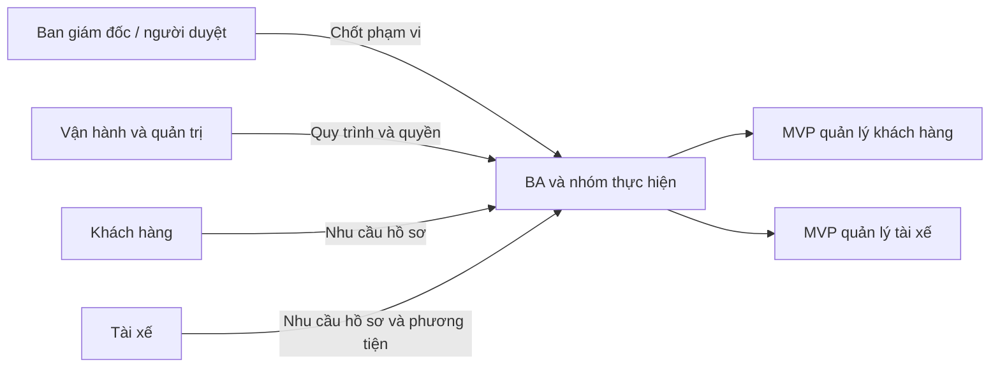
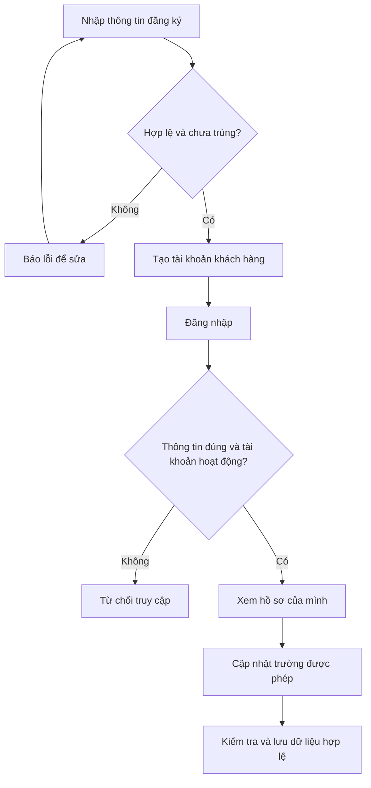
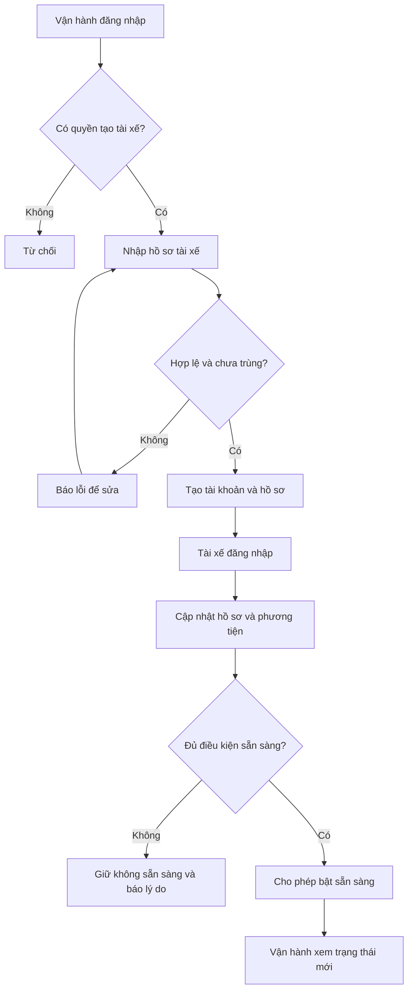
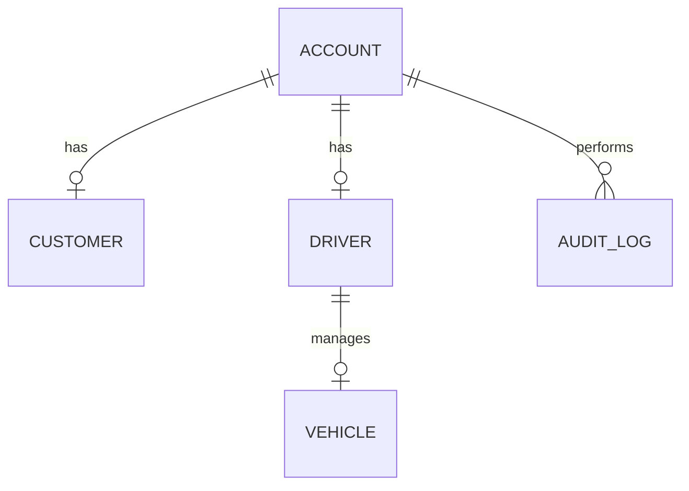

## 1. STAKEHOLDERS

| Tên bên liên quan | Vai trò |
|---|---|
| Khách hàng | Đăng ký, đăng nhập và quản lý thông tin cá nhân |
| Tài xế | Quản lý hồ sơ, phương tiện và trạng thái hoạt động |
| Nhân viên vận hành / quản trị | Quản lý dữ liệu khách hàng, tài xế và phương tiện theo quyền |
| Ban giám đốc ABC / người duyệt đề tài | Xác nhận phạm vi, ưu tiên, chính sách và nghiệm thu |
| BA và nhóm thực hiện | Phân tích, thiết kế, xây dựng, kiểm thử và bàn giao trong 7 tuần |

Việc phân biệt quản trị với nhân viên vận hành là đề xuất cụ thể hóa yêu cầu hạn chế thao tác nhạy cảm trong Word.

## 2. STAKEHOLDER MATRIX

Đánh giá ảnh hưởng–quan tâm dưới đây là đề xuất của BA.

| Bên liên quan | Ảnh hưởng | Quan tâm | Cách phối hợp |
|---|---|---|---|
| Ban giám đốc / người duyệt | Cao | Cao | Chốt phạm vi 2 module và phần chuyển giai đoạn sau |
| Vận hành / quản trị | Cao | Cao | Xác nhận dữ liệu, quyền và quy trình quản lý |
| Khách hàng | Thấp | Cao | Góp ý đăng ký, đăng nhập và chỉnh sửa hồ sơ |
| Tài xế | Trung bình | Cao | Góp ý hồ sơ, phương tiện và trạng thái |
| BA và nhóm thực hiện | Cao | Cao | Kiểm soát tiến độ và chất lượng |

## 3. BUSINESS GOALS

| Mã | Mục tiêu trong 7 tuần | Cách đánh giá |
|---|---|---|
| BG-01 | Quản lý tập trung thông tin khách hàng | Đăng ký, tra cứu và cập nhật trên cùng nguồn dữ liệu |
| BG-02 | Quản lý tập trung tài xế, phương tiện và trạng thái | Vận hành xem được thông tin và trạng thái mới nhất |
| BG-03 | Kiểm soát quyền truy cập và trách nhiệm thao tác | Chặn truy cập sai quyền và truy xuất được lưu vết |
| BG-04 | Bàn giao phạm vi nhỏ, có thể kiểm thử và trình diễn | Đạt AC của mục 15, có bản triển khai và tài liệu |

Tự động điều phối, theo dõi chuyến và quản lý doanh thu thuộc mục tiêu CAB đầy đủ, chưa phải chỉ tiêu nghiệm thu MVP. Mã BR ở mục 7 chuyển các mục tiêu trên thành yêu cầu nghiệp vụ cụ thể.

## 4. SYSTEM SCOPE

### 4.1. Trong phạm vi

**MVP-01 – Quản lý khách hàng:** khách tự đăng ký; đăng nhập/đăng xuất; xem và sửa hồ sơ của mình; vận hành xem danh sách, tìm kiếm, xem chi tiết và cập nhật khách hàng; quản trị khóa/mở khóa tài khoản.

**MVP-02 – Quản lý tài xế:** vận hành tạo tài khoản tài xế; tài xế đăng nhập, xem/sửa hồ sơ và phương tiện, đổi sẵn sàng/không sẵn sàng; vận hành tra cứu/cập nhật tài xế và phương tiện; quản trị khóa/mở khóa tài khoản.

**Dùng chung:** xác thực, phân quyền cố định, kiểm tra dữ liệu và lưu vết thao tác quan trọng. Đây là chức năng hỗ trợ hai module, không tách thành module nghiệp vụ mới.

### 4.2. Giới hạn đề xuất để thực hiện trong 7 tuần

| Nội dung | Giới hạn MVP |
|---|---|
| Giao diện | Một ứng dụng web hiển thị theo vai trò; chưa xây ứng dụng mobile riêng |
| Tạo tài xế | Chọn phương án vận hành tạo tài khoản trong Word; chưa làm tài xế tự đăng ký |
| Phương tiện | Mỗi tài xế tối đa một phương tiện hiện hành; cần xác nhận |
| Vai trò | Khách hàng, tài xế, vận hành, quản trị; quyền cố định, chưa làm cấu hình vai trò động |
| Trạng thái tài xế | Sẵn sàng / không sẵn sàng; chưa có đang phục vụ vì chưa có chuyến đi |
| Xóa | Không xóa vĩnh viễn hồ sơ; dùng khóa tài khoản hoặc ngừng sử dụng phương tiện theo quyền |
| Loại xe | Danh mục cấu hình sẵn phục vụ nhập hồ sơ phương tiện; chưa cần CRUD danh mục |
| Xác minh | Vận hành kiểm tra thủ công; chưa tích hợp OTP, eKYC hoặc kiểm tra giấy tờ tự động |

Các giới hạn trên là phương án thu gọn, không phải toàn bộ chính sách đã được khách hàng chốt.

### 4.3. Yêu cầu trong Word đề xuất triển khai giai đoạn sau

| Nhóm | Chức năng giữ lại cho giai đoạn sau |
|---|---|
| Đặt xe | Nhập điểm đón/điểm đến, khách chọn xe, tạo và hủy chuyến |
| Điều phối | Lưu vị trí phục vụ ghép xe, tìm tài xế gần, nhận/từ chối chuyến, tìm lại khi hết hạn |
| Thực hiện chuyến | ETA, theo dõi vị trí, trạng thái đã đến/đã đón/đang đi/hoàn thành |
| Cước và thanh toán | Tính cước, ghi nhận tiền mặt, tích hợp điện tử và xử lý giao dịch thất bại |
| Thông báo | Thông báo đặt xe, nhận chuyến, hoàn thành và kết quả thanh toán qua các kênh |
| Sau chuyến | Lịch sử chuyến, số tiền phải trả và đánh giá tài xế |
| Vận hành mở rộng | Hỗ trợ chuyến lỗi, tra cứu giao dịch, doanh thu, tỷ lệ hoàn thành/hủy và hiệu quả tài xế |
| Quy mô lớn | Kiểm chứng mở rộng độc lập, triển khai từng thành phần và cô lập lỗi thanh toán/thông báo |

Việc phân kỳ phải được người duyệt phạm vi xác nhận. Đồ án giai đoạn này là **phân hệ quản lý nền tảng**, chưa phải ứng dụng đặt xe hoàn chỉnh.

## 5. ACTORS

| Mã | Actor | Chức năng được dùng |
|---|---|---|
| ACT-01 | Khách chưa đăng nhập | Đăng ký khách hàng, đăng nhập |
| ACT-02 | Khách hàng | Xem/sửa hồ sơ của mình, đăng xuất |
| ACT-03 | Tài xế | Xem/sửa hồ sơ và phương tiện của mình, đổi trạng thái, đăng xuất |
| ACT-04 | Vận hành | Quản lý dữ liệu khách hàng, tạo và quản lý tài xế/phương tiện theo quyền |
| ACT-05 | Quản trị | Có quyền vận hành và quyền khóa/mở khóa tài khoản, tra cứu lưu vết |

Ban giám đốc là stakeholder phê duyệt, chưa cần tài khoản riêng. Nhà cung cấp bản đồ, thanh toán và thông báo chưa tham gia MVP.

## 6. MVP MODULES

### 6.1. Module triển khai

| Mã | Module | Kết quả tối thiểu |
|---|---|---|
| MVP-01 | Quản lý khách hàng | Khách dùng được tài khoản/hồ sơ; vận hành tra cứu và cập nhật theo quyền |
| MVP-02 | Quản lý tài xế | Vận hành tạo được tài xế; tài xế quản lý hồ sơ/xe/trạng thái; vận hành xem đúng dữ liệu |

Không bắt buộc mọi đối tượng đều có đủ CRUD. Không thêm API xóa vĩnh viễn hoặc chức năng không cần thiết chỉ để đủ Create, Read, Update, Delete.

### 6.2. Kế hoạch 7 tuần

| Tuần | Công việc | Kết quả cần đạt |
|---|---|---|
| 1 | Chốt phạm vi, quyền, dữ liệu, TBD; hoàn thiện SRS, ERD, use case | Phạm vi 2 module và AC được duyệt; xác định nguồn lực |
| 2 | Thiết kế giao diện/API/cơ sở dữ liệu; xác thực và phân quyền | Khung ứng dụng chạy được, đăng nhập/đăng xuất và quyền cơ bản |
| 3 | Xây dựng quản lý khách hàng | Đăng ký, hồ sơ, danh sách, tìm kiếm và cập nhật hoạt động |
| 4 | Xây dựng quản lý tài xế và phương tiện | Tạo tài xế, sửa hồ sơ/xe, kiểm tra quyền sở hữu |
| 5 | Trạng thái, khóa tài khoản, lưu vết và tích hợp | Hai module chạy thông suốt, dữ liệu nhất quán |
| 6 | Kiểm thử AC, phân quyền, dữ liệu sai và hiệu năng cơ bản; sửa lỗi | Có kết quả kiểm thử; xử lý lỗi nghiêm trọng |
| 7 | Kiểm thử hồi quy phần sửa, triển khai, tài liệu và báo cáo | Bản trình diễn, dữ liệu mẫu, hướng dẫn và bàn giao |

Giả định môi trường sẵn có và người duyệt phản hồi kịp thời. Chưa biết quy mô nhóm nên đây là kế hoạch đề xuất, không phải ước lượng năng lực đã được kiểm chứng. Thay đổi phạm vi cần đánh giá lại tiến độ.

## 7. BUSINESS REQUIREMENTS

| Mã | Yêu cầu nghiệp vụ | Mục tiêu | Module |
|---|---|---|---|
| BR-01 | Doanh nghiệp cần quản lý tập trung tài khoản và thông tin khách hàng | BG-01 | MVP-01 |
| BR-02 | Khách cần tự đăng ký, truy cập và cập nhật thông tin cá nhân | BG-01 | MVP-01 |
| BR-03 | Doanh nghiệp cần tạo và quản lý tài xế gắn với phương tiện | BG-02 | MVP-02 |
| BR-04 | Tài xế cần cập nhật hồ sơ, phương tiện và trạng thái sẵn sàng | BG-02 | MVP-02 |
| BR-05 | Vận hành cần tìm kiếm, tra cứu và cập nhật dữ liệu theo quyền | BG-01/02 | Cả hai |
| BR-06 | Doanh nghiệp cần xác thực, hạn chế thao tác nhạy cảm và truy vết thay đổi | BG-03 | Cả hai |

Khách chọn xe để đặt chuyến thuộc mục 4.3; không đưa vào FR hiện tại khi chưa triển khai module đặt xe.

## 8. BUSINESS PROCESS MODELING

### 8.1. Đăng ký và quản lý hồ sơ khách hàng

### 8.2. Quản lý tài xế và trạng thái

Đây là lưu đồ Mermaid, không phải BPMN 2.0. Sẵn sàng trong MVP chỉ là trạng thái quản lý; chưa tự động dẫn đến nhận chuyến.

## 9. FUNCTIONAL REQUIREMENTS

| Mã | Yêu cầu chức năng | BR | AC |
|---|---|---|---|
| FR-MVP-01 | Cho khách đăng ký tài khoản bằng dữ liệu hợp lệ, không trùng định danh | BR-02 | AC-01 |
| FR-MVP-02 | Cho các vai trò đăng nhập/đăng xuất; chặn tài khoản khóa và phiên không hợp lệ | BR-02/06 | AC-02 |
| FR-MVP-03 | Cho khách xem/sửa hồ sơ của mình, không sửa vai trò hoặc trạng thái tài khoản | BR-01/02 | AC-03 |
| FR-MVP-04 | Cho vận hành xem danh sách phân trang, tìm theo tên/định danh, xem chi tiết và cập nhật khách hàng | BR-01/05 | AC-04 |
| FR-MVP-05 | Cho vận hành tạo tài khoản và hồ sơ tài xế, ban đầu không sẵn sàng | BR-03 | AC-05 |
| FR-MVP-06 | Cho tài xế xem và cập nhật hồ sơ của mình | BR-04 | AC-06 |
| FR-MVP-07 | Cho tài xế thêm/cập nhật phương tiện của mình; vận hành tra cứu, cập nhật và ngừng sử dụng phương tiện theo quyền | BR-03/04/05 | AC-07 |
| FR-MVP-08 | Cho tài xế đổi sẵn sàng/không sẵn sàng; kiểm tra điều kiện trước khi bật sẵn sàng | BR-04 | AC-08 |
| FR-MVP-09 | Cho vận hành xem danh sách phân trang, tìm kiếm, lọc trạng thái, xem chi tiết và cập nhật tài xế | BR-03/05 | AC-09 |
| FR-MVP-10 | Cho quản trị khóa/mở khóa tài khoản khách hoặc tài xế; khóa tài xế đưa về không sẵn sàng | BR-06 | AC-10 |
| FR-MVP-11 | Kiểm tra vai trò và quyền sở hữu tại máy chủ cho mọi chức năng được bảo vệ | BR-06 | AC-11 |
| FR-MVP-12 | Tự động lưu vết thao tác quan trọng; cho quản trị tra cứu theo đối tượng/thời gian | BR-06 | AC-12 |

Một FR có thể được thực hiện qua nhiều API. Bộ API 8 module của bản trước thuộc phạm vi cũ, **không dùng nguyên trạng để nghiệm thu SRS 2.0**.

## 10. BUSINESS RULES

| Mã | Quy tắc | Cơ sở |
|---|---|---|
| RULE-01 | Chức năng bảo vệ phải xác thực; đăng ký/đăng nhập không cần phiên trước đó | Word và cụ thể hóa |
| RULE-02 | Khách/tài xế chỉ sửa dữ liệu của mình; vận hành theo quyền; không tự cấp vai trò | Yêu cầu bảo mật |
| RULE-03 | Định danh đăng nhập phải duy nhất; loại định danh và chuẩn hóa theo TBD-02 | Đề xuất |
| RULE-04 | Tài xế do vận hành tạo, ban đầu không sẵn sàng | Lựa chọn phạm vi từ Word |
| RULE-05 | Một tài xế tối đa một xe hiện hành, biển số không trùng; chi tiết TBD-03 | Đề xuất thu gọn |
| RULE-06 | Chỉ bật sẵn sàng khi tài khoản hoạt động và hồ sơ/xe đủ điều kiện; ngừng sử dụng xe phải đưa tài xế về không sẵn sàng | Đề xuất, TBD-03/04 |
| RULE-07 | Khóa tài khoản chặn cả đăng nhập và phiên cũ; mở khóa không tự bật sẵn sàng | Đề xuất, TBD-04 |
| RULE-08 | Không xóa vĩnh viễn hồ sơ trong MVP; thời hạn lưu theo TBD-06 | Đề xuất phân kỳ |
| RULE-09 | Thao tác quan trọng phải có lưu vết; không ghi mật khẩu/token vào log | Word; danh mục TBD-05 |

## 11. NON-FUNCTIONAL REQUIREMENTS

| Mã | Yêu cầu | Cách kiểm chứng |
|---|---|---|
| NFR-01 | Xác thực, vai trò và quyền sở hữu được kiểm tra ở máy chủ | Gọi API chưa đăng nhập, sai vai trò hoặc ID của người khác phải bị chặn |
| NFR-02 | Bảo vệ dữ liệu cá nhân/phương tiện; không lưu mật khẩu dạng rõ hoặc trả bí mật trong hồ sơ/log | Rà soát lưu trữ, response, log và kết nối khi triển khai |
| NFR-03 | Tra cứu đáp ứng ngưỡng thời gian dưới tải thử đã thống nhất | Đề xuất 20 phiên đồng thời, 1.000 hồ sơ, p95 ≤ 2 giây cho tra cứu; phải duyệt tại TBD-07 |
| NFR-04 | Tài khoản, hồ sơ và trạng thái nhất quán khi lỗi hoặc cập nhật đồng thời | Kiểm thử tạo tài xế lỗi giữa chừng, trùng định danh và khóa tài khoản |
| NFR-05 | Dữ liệu có khả năng sao lưu/phục hồi | Thử phục hồi dữ liệu mẫu; chu kỳ và mục tiêu phục hồi theo TBD-06 |
| NFR-06 | Giao diện thể hiện rõ trường bắt buộc, lỗi và kết quả thao tác | Kiểm tra luồng đăng ký, hồ sơ, phương tiện và khóa tài khoản |
| NFR-07 | Mã nguồn chia rõ hai module và phần dùng chung, có tài liệu API | Rà soát cấu trúc và tài liệu bàn giao |

NFR-03 là mức thử nghiệm đồ án đề xuất, không phải cam kết phục vụ quy mô lớn của ABC. MVP chưa chứng minh mở rộng độc lập hay cô lập lỗi thanh toán/thông báo khi chưa có các phân hệ đó.

## 12. EXCEPTION CASES

| Mã | Tình huống | Xử lý |
|---|---|---|
| EX-01 | Thiếu hoặc sai dữ liệu | Chỉ rõ lỗi, không lưu dữ liệu không hợp lệ |
| EX-02 | Trùng định danh hoặc biển số | Từ chối thao tác, giữ dữ liệu hiện tại |
| EX-03 | Sai đăng nhập, tài khoản khóa hoặc phiên hết hiệu lực | Từ chối truy cập, không tiết lộ bí mật |
| EX-04 | Sửa hồ sơ/xe người khác | Chặn ở máy chủ, không thay đổi dữ liệu |
| EX-05 | Bật sẵn sàng khi chưa đủ điều kiện | Giữ không sẵn sàng, báo lý do |
| EX-06 | Mất mạng khi lưu | Không báo thành công khi chưa xác nhận; khi kết nối lại đọc trạng thái hiện có trước khi gửi lại |
| EX-07 | Lỗi giữa lúc tạo tài khoản và hồ sơ tài xế | Hoàn tác hoặc xử lý nhất quán, không để tài khoản thiếu hồ sơ |
| EX-08 | Hai người sửa cùng hồ sơ | Phát hiện xung đột, yêu cầu tải lại thay vì âm thầm ghi đè dữ liệu cũ |
| EX-09 | Vận hành thường cố khóa tài khoản/xem audit | Từ chối thao tác vượt quyền |

## 13. OPEN QUESTIONS / TBD

| Mã | Câu hỏi | Người xác nhận | Thời điểm |
|---|---|---|---|
| TBD-01 | Chấp nhận 2 module và phân kỳ mục 4.3 không? Nhóm có bao nhiêu nguồn lực, môi trường bàn giao gì? | Người duyệt, nhóm thực hiện | Tuần 1 |
| TBD-02 | Đăng nhập bằng điện thoại hay email? Trường hồ sơ bắt buộc, mật khẩu, phiên và cách bàn giao tài khoản tài xế? | Người duyệt, vận hành | Tuần 1 |
| TBD-03 | Chấp nhận một xe hiện hành/tài xế? Trường xe, loại xe, biển số, điều kiện hồ sơ hợp lệ? | Vận hành | Tuần 1 |
| TBD-04 | Ai được khóa/mở khóa hoặc ngừng xe? Có cần lý do? Điều kiện bật sẵn sàng? | Người duyệt, vận hành | Tuần 1 |
| TBD-05 | Ma trận quyền và danh mục thao tác cần lưu vết cụ thể? | Người duyệt, vận hành | Tuần 1 |
| TBD-06 | Lưu hồ sơ/audit bao lâu? Sao lưu, phục hồi và xử lý yêu cầu xóa dữ liệu? | Người duyệt, nhóm thực hiện | Trước bàn giao |
| TBD-07 | Ngưỡng tải, môi trường và trình duyệt nghiệm thu? | Người duyệt, nhóm kiểm thử | Trước tuần 6 |

TBD về cước, ghép xe, hủy, mất mạng khi đang thực hiện chuyến và thanh toán từ Word được giữ cho giai đoạn sau, không tự đặt chính sách để mở rộng MVP hiện tại.

## 14. ENTITY MODEL

| Thực thể | Thuộc tính tiêu biểu | Mục đích |
|---|---|---|
| Account | accountId, loginIdentifier, passwordHash, role, status, createdAt | Tài khoản và vai trò cố định |
| Customer | customerId, accountId, fullName, contactInfo, updatedAt | Hồ sơ khách hàng |
| Driver | driverId, accountId, fullName, contactInfo, availability, updatedAt | Hồ sơ và trạng thái tài xế |
| Vehicle | vehicleId, driverId, plateNumber, vehicleType, model, status | Phương tiện hiện hành |
| AuditLog | auditId, actorAccountId, action, entityType, entityId, occurredAt, result | Dấu vết thao tác quan trọng |

- Một hồ sơ thuộc đúng một tài khoản. Vận hành/quản trị không cần hồ sơ Customer/Driver.
- MVP đề xuất một vai trò/tài khoản; chưa có nhiều vai trò hoặc bảng quyền động.
- Quan hệ tối đa một xe hiện hành/tài xế cần xác nhận. Thay đổi thông tin xe được lưu vết theo chính sách.
- Chỉ lưu mật khẩu đã băm phù hợp, không trả passwordHash qua API.
- Loại xe là danh mục cấu hình; chưa cần module quản trị riêng.
- Chưa có Trip, Payment, Rating và Notification trong mô hình dữ liệu MVP.

## 15. USE CASES

### 15.1. Danh mục

| Mã | Use case | Actor | FR |
|---|---|---|---|
| UC-01 | Đăng ký khách hàng | Khách chưa đăng nhập | FR-MVP-01 |
| UC-02 | Đăng nhập/đăng xuất | Các vai trò | FR-MVP-02 |
| UC-03 | Quản lý hồ sơ cá nhân | Khách hàng, tài xế | FR-MVP-03/06 |
| UC-04 | Quản lý khách hàng | Vận hành | FR-MVP-04 |
| UC-05 | Tạo và quản lý tài xế | Vận hành | FR-MVP-05/09 |
| UC-06 | Quản lý phương tiện | Tài xế, vận hành | FR-MVP-07 |
| UC-07 | Đổi trạng thái sẵn sàng | Tài xế | FR-MVP-08 |
| UC-08 | Khóa/mở khóa tài khoản | Quản trị | FR-MVP-10 |
| UC-09 | Tra cứu lưu vết | Quản trị | FR-MVP-12 |

FR-MVP-11 là kiểm tra quyền xuyên suốt, không phải thao tác độc lập để người dùng gọi.

### 15.2. UC-05 – Tạo tài xế

**Tiền điều kiện:** Vận hành đã đăng nhập và có quyền tạo tài xế.

1. Nhập thông tin bắt buộc của tài xế.
2. Hệ thống kiểm tra dữ liệu và định danh trùng.
3. Tạo tài khoản vai trò tài xế cùng hồ sơ, mặc định không sẵn sàng.
4. Lưu vết, hiển thị kết quả và cho tra cứu tài xế vừa tạo.
5. Bàn giao cách truy cập theo chính sách TBD-02.

**Ngoại lệ:** Thiếu/trùng dữ liệu thì báo lỗi; sai quyền không tạo dữ liệu; lỗi lưu một phần không để tài khoản và hồ sơ lệch nhau.

**Hậu điều kiện:** Có tài khoản và hồ sơ nhất quán, chưa tự động bật sẵn sàng.

### 15.3. UC-07 – Đổi trạng thái

**Tiền điều kiện:** Tài xế đăng nhập bằng tài khoản hoạt động.

1. Tài xế xem trạng thái hiện tại và chọn trạng thái mới.
2. Khi bật sẵn sàng, hệ thống kiểm tra điều kiện hồ sơ và phương tiện.
3. Lưu trạng thái hợp lệ, hiển thị kết quả; vận hành xem được trạng thái mới.

**Ngoại lệ:** Thiếu điều kiện giữ không sẵn sàng; tài khoản bị khóa thì từ chối; mất mạng không báo thành công khi chưa xác nhận.

**Hậu điều kiện:** Trạng thái được ghi nhận đúng, không tạo hoặc phân công chuyến.

### 15.4. Acceptance Criteria

| Mã | Tiêu chí chấp nhận |
|---|---|
| AC-01 | Dữ liệu đăng ký hợp lệ tạo đúng một khách hàng; thiếu/trùng thì không tạo thêm |
| AC-02 | Đăng nhập đúng với tài khoản hoạt động thành công; sai/bị khóa bị chặn; phiên đã đăng xuất không gọi được chức năng bảo vệ |
| AC-03 | Khách xem/sửa được hồ sơ mình, tải lại vẫn đúng; sửa người khác hoặc vai trò bị chặn |
| AC-04 | Vận hành tìm, xem chi tiết, phân trang và cập nhật đúng khách hàng từ dữ liệu mẫu |
| AC-05 | Tạo tài xế sinh cả tài khoản/hồ sơ, ban đầu không sẵn sàng; lỗi/trùng không để dữ liệu dở dang |
| AC-06 | Tài xế xem/sửa đúng hồ sơ mình, không sửa người khác hoặc quyền tài khoản |
| AC-07 | Thêm/sửa xe hợp lệ thành công; trùng biển số/vượt quan hệ/sai chủ bị chặn; ngừng sử dụng xe theo quyền đưa tài xế về không sẵn sàng |
| AC-08 | Đủ điều kiện đổi được trạng thái, thiếu điều kiện không bật được; vận hành thấy trạng thái mới |
| AC-09 | Vận hành tìm/lọc tài xế, xem đúng hồ sơ/xe/trạng thái và cập nhật đúng trường cho phép |
| AC-10 | Quản trị khóa/mở khóa được tài khoản; khóa tài xế chặn phiên cũ và đưa không sẵn sàng; mở khóa không tự bật sẵn sàng |
| AC-11 | Gọi API trực tiếp chưa xác thực/sai vai trò/sai chủ sở hữu bị từ chối, không thay đổi dữ liệu |
| AC-12 | Thao tác quan trọng có log đủ chủ thể, hành động, đối tượng, thời điểm, kết quả; quản trị tra cứu được; người sai quyền bị chặn; không có mật khẩu/token trong log |

Nghiệm thu yêu cầu đạt AC-01–AC-12 và các kiểm tra NFR trong môi trường đã duyệt. Đây là tiêu chí dự kiến, chưa phải kết quả kiểm thử đã chạy.

## 16. REQUIREMENTS TRACEABILITY MATRIX

| Nguồn trong Word | BR | Module | FR | UC | AC |
|---|---|---|---|---|---|
| Khách đăng ký | BR-02 | MVP-01 | FR-MVP-01 | UC-01 | AC-01 |
| Xác thực khách và tài xế | BR-02/06 | Dùng chung | FR-MVP-02 | UC-02 | AC-02 |
| Khách cập nhật thông tin cá nhân | BR-01/02 | MVP-01 | FR-MVP-03 | UC-03 | AC-03 |
| Vận hành quản lý khách | BR-01/05 | MVP-01 | FR-MVP-04 | UC-04 | AC-04 |
| Vận hành tạo tài khoản tài xế | BR-03 | MVP-02 | FR-MVP-05 | UC-05 | AC-05 |
| Tài xế cập nhật hồ sơ | BR-04 | MVP-02 | FR-MVP-06 | UC-03 | AC-06 |
| Thông tin phương tiện | BR-03/04/05 | MVP-02 | FR-MVP-07 | UC-06 | AC-07 |
| Trạng thái sẵn sàng | BR-04 | MVP-02 | FR-MVP-08 | UC-07 | AC-08 |
| Vận hành quản lý tài xế | BR-03/05 | MVP-02 | FR-MVP-09 | UC-05 | AC-09 |
| Kiểm soát thao tác nhạy cảm | BR-06 | Dùng chung | FR-MVP-10/11 | UC-08 và UC được bảo vệ | AC-10/11 |
| Lưu vết quan trọng | BR-06 | Dùng chung | FR-MVP-12 | UC-09 | AC-12 |

Khóa/mở khóa, đăng xuất, trường dữ liệu, giới hạn xe và ngưỡng thử nghiệm là cụ thể hóa đề xuất, không phải nguyên văn Word. Các yêu cầu chưa triển khai được giữ ở mục 4.3 để xác nhận phân kỳ.

**Bàn giao:** SRS 2 module được duyệt; TBD ảnh hưởng triển khai đã chốt; có ứng dụng trình diễn, dữ liệu mẫu, ERD, API phù hợp FR-MVP và kết quả kiểm thử. Bộ API cũ phải được thu gọn/cập nhật truy vết trước khi dùng làm tài liệu bàn giao của phiên bản này.
