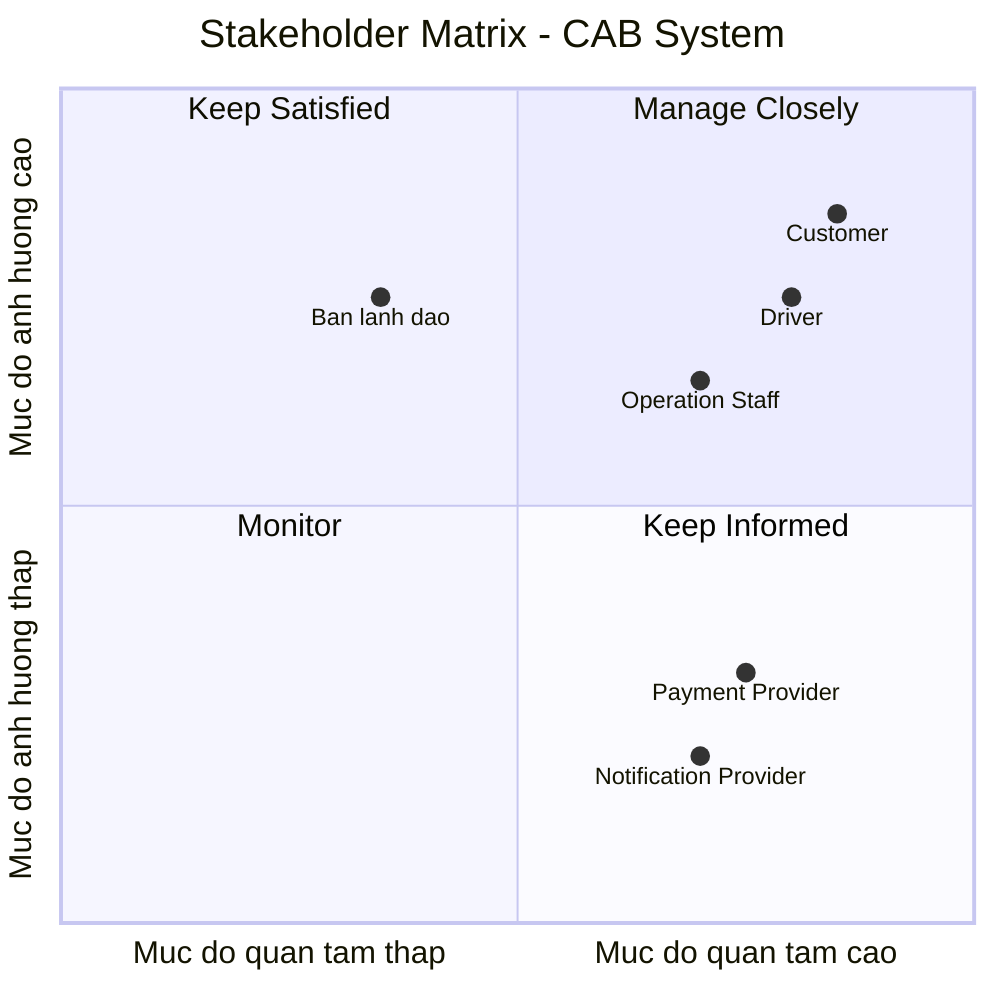

| Stakeholder | Vai trò |
|---|---|
| Khách hàng (Customer) | Người sử dụng dịch vụ đặt xe; tạo yêu cầu chuyến đi, theo dõi trạng thái chuyến, thanh toán và đánh giá tài xế. |
| Tài xế (Driver) | Người cung cấp dịch vụ vận chuyển; cập nhật trạng thái sẵn sàng và vị trí, nhận hoặc từ chối chuyến, thực hiện và cập nhật trạng thái chuyến đi. |
| Nhân viên vận hành (Operation Staff) | Theo dõi và hỗ trợ hoạt động của hệ thống; quản lý khách hàng, tài xế, phương tiện, chuyến đi, kiểm tra trạng thái tài xế và tra cứu giao dịch. |
| Ban lãnh đạo/Ban giám đốc | Đưa ra định hướng và yêu cầu nghiệp vụ; quan tâm đến khả năng mở rộng hệ thống, hiệu quả hoạt động, doanh thu và các báo cáo quản lý. |
| Nhà cung cấp thanh toán bên ngoài (External Payment Provider) | Cung cấp dịch vụ xử lý thanh toán điện tử và trả kết quả giao dịch về CAB System. |
| Nhà cung cấp dịch vụ thông báo (Notification Provider) | Hỗ trợ gửi thông báo cho khách hàng và tài xế về các sự kiện như nhận chuyến, tài xế đến, hoàn thành chuyến và kết quả thanh toán. |

## Stakeholder Matrix - CAB System

