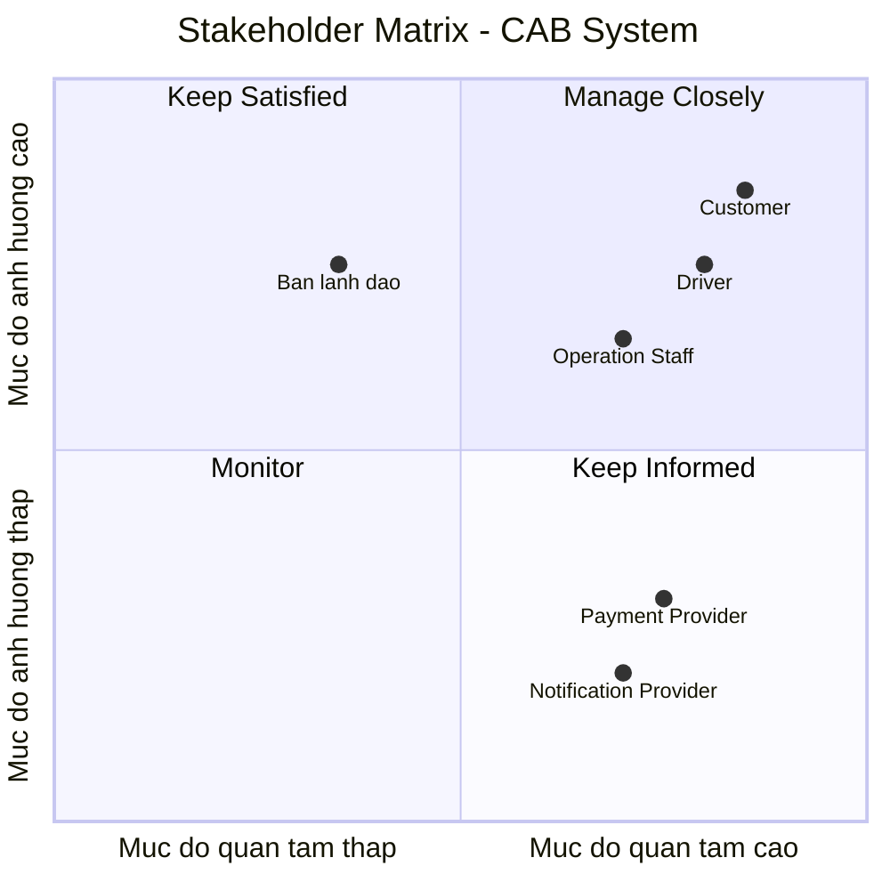

| Stakeholder | Vai trò |
|---|---|
| Khách hàng (Customer) | Người sử dụng dịch vụ đặt xe; tạo yêu cầu chuyến đi, theo dõi trạng thái chuyến, thanh toán và đánh giá tài xế. |
| Tài xế (Driver) | Người cung cấp dịch vụ vận chuyển; cập nhật trạng thái sẵn sàng và vị trí, nhận hoặc từ chối chuyến, thực hiện và cập nhật trạng thái chuyến đi. |
| Nhân viên vận hành (Operation Staff) | Theo dõi và hỗ trợ hoạt động của hệ thống; quản lý khách hàng, tài xế, phương tiện, chuyến đi, kiểm tra trạng thái tài xế và tra cứu giao dịch. |
| Ban lãnh đạo/Ban giám đốc | Đưa ra định hướng và yêu cầu nghiệp vụ; quan tâm đến khả năng mở rộng hệ thống, hiệu quả hoạt động, doanh thu và các báo cáo quản lý. |
| Nhà cung cấp thanh toán bên ngoài (External Payment Provider) | Cung cấp dịch vụ xử lý thanh toán điện tử và trả kết quả giao dịch về CAB System. |
| Nhà cung cấp dịch vụ thông báo (Notification Provider) | Hỗ trợ gửi thông báo cho khách hàng và tài xế về các sự kiện như nhận chuyến, tài xế đến, hoàn thành chuyến và kết quả thanh toán. |

## Stakeholder Matrix - CAB System

# CAB SYSTEM - CHUYỂN ĐỔI YÊU CẦU THÀNH MỤC TIÊU NGHIỆP VỤ & BUSINESS RULES

**Dự án:** Nền tảng đặt xe CAB System  
**Phiên bản:** MVP 1.0 (Kế hoạch triển khai 7 tuần)  
**Tác giả:** Senior Business Analyst  
**Ngày lập:** 06/09/2026  
**Trạng thái quy tắc:** `Confirmed` (Đã xác nhận) | `TBD` (To Be Determined - Chờ khách hàng làm rõ)

---

## 1. BẢNG CHUYỂN ĐỔI: TỪ YÊU CẦU KHÁCH HÀNG ĐẾN MỤC TIÊU NGHIỆP VỤ (MAPPING)

| Mã YC | Yêu cầu của Khách hàng | Mục tiêu Nghiệp vụ (Business Objective) | Mã Quy tắc liên quan (BR Code) |
| :--- | :--- | :--- | :--- |
| **CR-01** | Khách hàng và tài xế phải có tài khoản rõ ràng, an toàn để sử dụng ứng dụng. | Đảm bảo tính định danh, an toàn pháp lý và phân quyền chuẩn xác giữa các đối tượng người dùng. | `BR-AUTH-01`, `BR-AUTH-02` |
| **CR-02** | Khách hàng cần biết trước lộ trình di chuyển và giá tiền dự kiến trước khi quyết định gọi xe. | Minh bạch hóa thông tin chi phí để tăng tỷ lệ chuyển đổi đặt xe và giảm tỷ lệ hủy chuyến do bất ngờ về giá. | `BR-PRICING-01`, `BR-BOOKING-01` |
| **CR-03** | Hệ thống tự động tìm và kết nối cuốc xe đến tài xế phù hợp ở gần nhất một cách nhanh chóng. | Tối ưu hóa thời gian chờ đón xe của khách hàng (ETA) và giảm thiểu quãng đường di chuyển không tải của tài xế. | `BR-DISPATCH-01`, `BR-DISPATCH-02`, `BR-DISPATCH-03` |
| **CR-04** | Tài xế có quyền quyết định nhận hoặc bỏ qua chuyến xe được mời. | Tôn trọng tính chủ động của đối tác tài xế, đồng thời tự động tái điều phối để không làm gián đoạn yêu cầu của khách. | `BR-DISPATCH-02`, `BR-DISPATCH-04` |
| **CR-05** | Tiến trình chuyến đi (đón khách, đang đi, trả khách) phải được cập nhật minh bạch cho cả hai bên. | Nâng cao mức độ tin cậy, kiểm soát hành trình theo thời gian thực và làm căn cứ giải quyết tranh chấp. | `BR-STATE-01`, `BR-STATE-02` |
| **CR-06** | Hỗ trợ thanh toán thuận tiện bằng cả tiền mặt và phương thức điện tử khi chuyến đi hoàn thành. | Đảm bảo thu hồi đủ doanh thu chuyến xe, tối ưu dòng tiền và không làm giam giữ thời gian của tài xế. | `BR-PAY-01`, `BR-PAY-02`, `BR-PAY-03` |
| **CR-07** | Cho phép khách hàng phản ánh chất lượng phục vụ của tài xế sau mỗi chuyến đi. | Kiểm soát chất lượng dịch vụ của đội ngũ tài xế và làm cơ sở duy trì tiêu chuẩn vận hành nền tảng. | `BR-RATE-01` |
| **CR-08** | Nhân viên nội bộ có công cụ theo dõi, giám sát và can thiệp sự cố hoặc hủy cuốc bất thường. | Đảm bảo khả năng vận hành liên tục, xử lý sự cố kịp thời và bảo vệ quyền lợi của các bên liên quan. | `BR-OPS-01`, `BR-CANCEL-01` |

---

## 2. DANH MỤC QUY TẮC NGHIỆP VỤ (BUSINESS RULES - BR)

### Nhóm 1: Xác thực & Quản lý Tài khoản (BR-AUTH)

#### `BR-AUTH-01`: Định danh duy nhất theo vai trò
* **Mục tiêu:** Kiểm soát phân quyền và trách nhiệm pháp lý của từng nhóm người dùng.
* **Quy tắc:** Mỗi tài khoản đăng ký phải được gắn với một số điện thoại duy nhất. Tại một phiên làm việc (Session), một người dùng chỉ được hoạt động dưới đúng **01 vai trò (Role)**: Customer, Driver hoặc Operation Staff.
* **Trạng thái:** `Confirmed`.

#### `BR-AUTH-02`: Điều kiện kích hoạt đối tác Tài xế
* **Mục tiêu:** Đảm bảo tiêu chuẩn an toàn và tính hợp pháp của phương tiện tham gia nền tảng.
* **Quy tắc:** Tài khoản Driver chỉ được chuyển sang trạng thái hoạt động (`ACTIVE`) sau khi hồ sơ cá nhân (CMND/CCCD, Giấy phép lái xe, Đăng ký xe, Bảo hiểm bắt buộc) đã được Operation Staff xác thực thủ công thành công trên hệ thống quản trị.
* **Trạng thái:** `Confirmed`.

---

### Nhóm 2: Yêu cầu & Tạo Chuyến xe (BR-BOOKING)

#### `BR-BOOKING-01`: Ràng buộc thông tin khởi tạo cuốc xe
* **Mục tiêu:** Tránh các yêu cầu rác và đảm bảo đủ dữ liệu để tính toán lộ trình.
* **Quy tắc:** Để gửi yêu cầu đặt xe thành công, Customer bắt buộc phải cung cấp:
  1. Tọa độ điểm đón hợp lệ.
  2. Tọa độ điểm đến hợp lệ (khác tọa độ đón tối thiểu 100 mét).
  3. Lựa chọn loại phương tiện (Xe 4 chỗ, Xe máy...).
  4. Phương thức thanh toán mặc định cho chuyến đi.
* **Trạng thái:** `Confirmed`.

#### `BR-BOOKING-02`: Giới hạn số chuyến xe đồng thời
* **Mục tiêu:** Ngăn chặn đặt xe ảo và lạm dụng tài nguyên điều phối.
* **Quy tắc:** Tại một thời điểm, một Customer chỉ được phép có tối đa **01 chuyến xe đang hoạt động** (từ trạng thái `REQUESTED` đến `IN_PROGRESS`). Không được tạo cuốc mới khi cuốc hiện tại chưa hoàn thành hoặc chưa hủy.
* **Trạng thái:** `Confirmed`.

---

### Nhóm 3: Điều phối & Ghép chuyến (BR-DISPATCH)

#### `BR-DISPATCH-01`: Tiêu chí lọc Driver khả dụng
* **Mục tiêu:** Chỉ gửi tín hiệu mời cuốc cho tài xế thực sự sẵn sàng phục vụ.
* **Quy tắc:** Một Driver chỉ được đưa vào danh sách ứng viên nhận chuyến khi thỏa mãn đồng thời 4 điều kiện:
  1. Tài khoản ở trạng thái `ACTIVE`.
  2. Đang bật chế độ nhận việc (`ONLINE`).
  3. Đang không thực hiện bất kỳ chuyến xe nào khác (`is_busy = false`).
  4. Vị trí GPS được cập nhật trong vòng tối đa **60 giây** gần nhất.
* **Trạng thái:** `Confirmed`.

#### `BR-DISPATCH-02`: Quy tắc ưu tiên và Bán kính quét cuốc
* **Mục tiêu:** Rút ngắn tối đa thời gian chờ đón khách (ETA).
* **Quy tắc:** Hệ thống tự động quét các Driver khả dụng trong bán kính ban đầu tính từ điểm đón khách. Thứ tự mời cuốc được sắp xếp ưu tiên theo khoảng cách di chuyển từ vị trí tài xế đến điểm đón (ngắn nhất trước).
* **Trạng thái:** `TBD`.
* **Câu hỏi BA cần làm rõ:** 
  > *Bán kính quét ban đầu là bao nhiêu km (ví dụ: 3km)? Khi không tìm thấy tài xế, bán kính mở rộng thêm bao nhiêu km (ví dụ: 5km, 7km)? Ưu tiên tuyệt đối theo khoảng cách (ETA) hay có kết hợp điểm đánh giá sao (Rating) của tài xế?*

#### `BR-DISPATCH-03`: Thời hạn phản hồi nhận cuốc (Timeout)
* **Mục tiêu:** Tránh làm gián đoạn thời gian chờ của khách hàng khi tài xế không tương tác.
* **Quy tắc:** Khi nhận được tín hiệu mời chuyến, Driver có đúng **N giây** đếm ngược để bấm "Chấp nhận". Nếu Driver bấm "Từ chối" hoặc đồng hồ về 0 (Timeout), hệ thống lập tức loại trừ Driver này khỏi phiên tìm kiếm hiện tại và chuyển tiếp tín hiệu mời chuyến đến Driver thỏa mãn điều kiện tiếp theo.
* **Trạng thái:** `TBD`.
* **Câu hỏi BA cần làm rõ:** 
  > *Thời gian đếm ngược chính xác để tài xế phản hồi là bao nhiêu giây (ví dụ: 15 giây, 20 giây hay 30 giây)?*

#### `BR-DISPATCH-04`: Giới hạn tìm kiếm và Dừng cuốc xe
* **Mục tiêu:** Đóng luồng xử lý và thông báo dứt khoát cho khách khi thị trường không có nguồn cung.
* **Quy tắc:** Hệ thống tự động dừng tìm kiếm và chuyển trạng thái chuyến xe sang `NO_DRIVER_FOUND` khi:
  - Đã gửi lời mời qua tối đa **M tài xế liên tiếp** nhưng không ai nhận, HOẶC
  - Tổng thời gian tìm kiếm của cuốc xe vượt quá **T phút**.
* **Trạng thái:** `TBD`.
* **Câu hỏi BA cần làm rõ:** 
  > *Giới hạn M (số tài xế tối đa thử gán, ví dụ: 3 hay 5 tài xế) và thời gian timeout tổng T (ví dụ: 2 phút hay 3 phút) là bao nhiêu?*

---

### Nhóm 4: Quản lý Trạng thái Chuyến đi (BR-STATE)

#### `BR-STATE-01`: Tính đơn hướng của Vòng đời chuyến xe (FSM)
* **Mục tiêu:** Bảo toàn tính toàn vẹn dữ liệu vận hành và ngăn chặn sai lệch trạng thái.
* **Quy tắc:** Vòng đời chuyến xe tuân thủ nghiêm ngặt máy trạng thái hữu hạn (FSM) một chiều:
  $$\text{REQUESTED} \longrightarrow \text{MATCHED} \longrightarrow \text{PICKING\_UP} \longrightarrow \text{IN\_PROGRESS} \longrightarrow \text{COMPLETED}$$
  Tuyệt đối không cho phép nhảy cóc trạng thái hoặc quay ngược trạng thái trước đó.
* **Trạng thái:** `Confirmed`.

#### `BR-STATE-02`: Quyền cập nhật trạng thái thực tế
* **Mục tiêu:** Buộc tài xế chịu trách nhiệm về mốc thời gian và vị trí thực tế của hành trình.
* **Quy tắc:** 
  - Trạng thái `MATCHED`: Hệ thống tự động cập nhật khi Driver bấm "Chấp nhận".
  - Trạng thái `PICKING_UP`: Do Driver chủ động bấm khi đã lái xe đến điểm đón khách.
  - Trạng thái `IN_PROGRESS`: Do Driver chủ động bấm sau khi xác nhận khách đã lên xe an toàn.
  - Trạng thái `COMPLETED`: Do Driver chủ động bấm khi đã dừng xe tại điểm trả khách.
* **Trạng thái:** `Confirmed`.

---

### Nhóm 5: Tính cước & Thanh toán (BR-PRICING & BR-PAY)

#### `BR-PRICING-01`: Công thức cấu thành cước phí chuyến đi
* **Mục tiêu:** Đảm bảo công thức tính tiền minh bạch, tự động và đúng thỏa thuận kinh doanh.
* **Quy tắc:** Cước phí chuyến đi được tính toán tự động dựa trên bảng giá cấu hình theo loại xe:
  $$\text{Tổng cước} = \text{Giá mở cửa} + (\text{Quãng đường thực tế (km)} \times \text{Đơn giá/km}) + (\text{Thời gian di chuyển (phút)} \times \text{Đơn giá/phút})$$
* **Trạng thái:** `TBD`.
* **Câu hỏi BA cần làm rõ:** 
  > *Trong MVP có tính cước thời gian (theo phút) không hay chỉ tính theo số km thực tế? Bảng giá mở cửa và đơn giá từng km cho từng loại xe (4 chỗ, 7 chỗ, xe máy) cụ thể là bao nhiêu? Có quy định mức cước tối thiểu cho một chuyến đi không?*

#### `BR-PAY-01`: Xác nhận Thanh toán Tiền mặt (Cash)
* **Mục tiêu:** Thu hồi công nợ trực tiếp ngay tại thời điểm kết thúc hành trình.
* **Quy tắc:** Với phương thức Tiền mặt, Driver có nghĩa vụ thu tiền trực tiếp từ Customer đúng bằng số tiền chốt trên hóa đơn và bấm nút "Xác nhận đã nhận tiền" trên app để hoàn tất giao dịch tài chính của cuốc xe.
* **Trạng thái:** `Confirmed`.

#### `BR-PAY-02`: Xác thực Thanh toán Điện tử (Digital Payment)
* **Mục tiêu:** Đảm bảo giao dịch số được trừ tiền an toàn, chống gian lận tài chính.
* **Quy tắc:** Trạng thái thanh toán của cuốc xe chỉ được chuyển sang `PAID` khi hệ thống nhận được tín hiệu phản hồi xác nhận thành công (`Webhook/Callback`) có chữ ký điện tử hợp lệ từ Cổng thanh toán đối tác.
* **Trạng thái:** `Confirmed`.

#### `BR-PAY-03`: Xử lý Thanh toán Điện tử Thất bại
* **Mục tiêu:** Tránh giữ chân tài xế khi cổng trung gian gặp sự cố kết nối hoặc khách hết tiền thẻ.
* **Quy tắc:** Khi cổng thanh toán báo lỗi (thẻ hết hạn, không đủ số dư, timeout kết nối quá thời hạn quy định), hệ thống lập tức hiển thị cảnh báo cho cả Khách hàng và Tài xế, đồng thời tự động chuyển đổi phương thức thanh toán sang **Tiền mặt (Cash)** để tài xế thu trực tiếp tại chỗ.
* **Trạng thái:** `Confirmed`.

---

### Nhóm 6: Hủy chuyến & Phạt vi phạm (BR-CANCEL)

#### `BR-CANCEL-01`: Điều kiện Hủy chuyến và Phí hủy (Cancellation Fee)
* **Mục tiêu:** Ngăn chặn việc hủy chuyến tùy tiện gây thiệt hại chi phí xăng xe và thời gian của các bên.
* **Quy tắc:** 
  - Khách hàng được quyền hủy chuyến miễn phí khi hệ thống đang ở trạng thái `REQUESTED`.
  - Khách hàng hoặc tài xế có thể hủy chuyến khi ở trạng thái `MATCHED` hoặc `PICKING_UP` kèm theo việc bắt buộc chọn lý do hủy.
* **Trạng thái:** `TBD`.
* **Câu hỏi BA cần làm rõ:** 
  > *Nếu khách hàng hủy chuyến sau khi tài xế đã di chuyển đón quá 3 phút (hoặc tài xế đã đến nơi), khách hàng có bị phạt phí hủy chuyến không? Mức phí phạt là bao nhiêu và xử lý truy thu bằng cách nào trong phiên bản MVP?*

---

### Nhóm 7: Đánh giá & Giám sát Vận hành (BR-RATE & BR-OPS)

#### `BR-RATE-01`: Nguyên tắc Đánh giá Chất lượng
* **Mục tiêu:** Thu thập dữ liệu khách quan để đo lường mức độ hài lòng về dịch vụ.
* **Quy tắc:** Mỗi chuyến xe có trạng thái `COMPLETED` và thanh toán `PAID` chỉ được Customer đánh giá **duy nhất 01 lần**. Thang điểm đánh giá là số nguyên từ 1 đến 5 sao. Đánh giá khi đã gửi thành công sẽ được ghi nhận vĩnh viễn và không thể chỉnh sửa.
* **Trạng thái:** `Confirmed`.

#### `BR-OPS-01`: Quyền hạn Can thiệp của Vận hành (Operation Staff)
* **Mục tiêu:** Đảm bảo tính an toàn dữ liệu và quyền giải tỏa các điểm nghẽn của hệ thống.
* **Quy tắc:** 
  - Operation Staff có quyền tra cứu thông tin chi tiết toàn bộ lịch sử các cuốc xe.
  - Operation Staff được quyền thực hiện lệnh **Hủy cuốc cưỡng bức (Force Cancel)** kèm nhập lý do nghiệp vụ bắt buộc đối với các chuyến xe đang treo (`REQUESTED`, `MATCHED`, `PICKING_UP`, `IN_PROGRESS`).
  - Operation Staff **không được phép** chỉnh sửa số tiền cước của những chuyến đi đã chuyển trạng thái `PAID`.
* **Trạng thái:** `Confirmed`.
